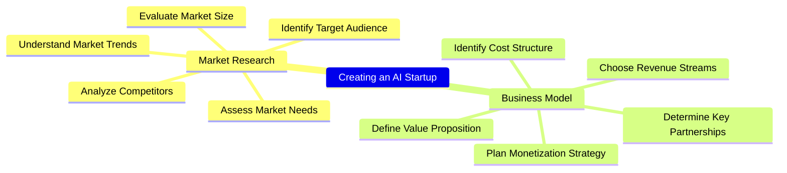

# Mindjet Mindmanager automation and OpenAI Integration

These automations and macros enhance mindmaps created by **Mindjet Mindmanager**.

## Features

- Windows and MACOS
- On Windows the **Python** logic can be called from a macro or by starting the **Python** script directly   
- On MACOS the **Python** logic can be called by an **Automator** workflow ie. **Quick Action** or by starting the **Python** script directly   
- Utilizes **OPENAI** or **Azure OPENAI** api infrastructure for generation
- Configuration for OpenAI api can be found and modified in `config.py`

## Implemented Use Cases

1. Refinement of the map or topic.  
2. Refinement of the map or topic from a development perspective.  
3. Create examples for one, more (selected) or all topics.  
4. Clustering topics from scratch.  
5. Clustering by one or more criterias eg. Organization/Process/Project/Expertise, Capex-Opex perspective.  
6. Complex cases (multiple calls): eg. refinement + clustering + examples.  

## Examples  
### Windows  
  

  

### MACOS
  

## Installation  
### Windows  
Run `install.bat` or  
```
pip install --upgrade requests
pip install --upgrade pywin32
```
Macros can be registered directly by merging the `macro_registration.reg` to the registry. Hint: view order in Mindmanager is sorted by the GUIDs. All macros can then be executed using the context menu of topics (right mouse button click).  

  

Macros can also be executed by the Macro Editor. The macros are similar but the action parameter.  

  

### MACOS  
```
pip install --upgrade requests
pip install --upgrade appscript
```
Automator workflows can be copied to the Services folder by executing the `copy_to_services.sh` shell script. To make the script executable:
```
chmod +x ./copy_to_services.sh
```  

All **Automator** workflow settings are similar but the action parameter:  


The workflows are then available at the "MindManager" main menu -> Services  


## Configuration  
OpenAI/AzureOpenAI relevant information should be stored in environment variables and mapped to the corresponding variables in the `config-py` file. Some parameters are not used at the moment (token count, levels deep etc.).  

  

## Prompt crafting  
Prompt crafting is lightly implemented using the following strategy:  

  

## Platform specific implementations
### Windows  
MindManager COM objects are addressed by using the PyWin32 library:  


### MACOS  
MindManager objects are addressed by using the AppScript library:  


## Implementation details  
The Mermaid mindmap syntax is used when talking to the OpenAI LLM as an intermediate "language". Log file contents for input, output, prompt can be used in other use cases eg. mindmap visualizations in GitHub markdown files.  

  

Log files content:  


Example using a Mermaid mindmap in a (this!) GitHub markdown file.  
Code:
```


Github rendering of the (this!) map:



You can also use the content inside the Mermaid online editor (https://mermaid.live/edit):  

  


## Disclaimer

The OpenAI API execution time can be somewhat lengthy, typically around 20 seconds per call. For more intricate use cases, this duration can extend to 2 minutes or more, with execution time also varying based on token count.

Currently, this project is in the early development phase, and generated outputs may include errors. Automated testing has not yet been implemented.

Should a runtime error occur, please attempt at least a second call to the process ;-)
