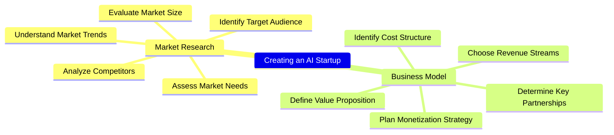

# MindManager Automation and AI Integration Windows + macOS

These automations and macros enhance mindmaps created by **MindManager** on macOS and Windows.

## Windows  
  

## macOS  
  

Note: Image generation with DALL-E 3 or SD3 needs far more time than in these animations.  
More animated examples are in the `doc` folder.

## Features

### Supported LLMs
  - **Azure OpenAI** w/ ***GPT-4o*** (use your key or log in with Azure EntraID) -> **best tested**
  - **OpenAI** w/ ***GPT-4o*** (use your key) -> **best results**
  - **Anthropic** w/ ***Claude 3 / 3.5*** (use your key)  
  - **Groq** (platform) w/ ***LLaMA3***, ***Mixtral***, ***Gemma2*** (use your key)
  - **Perplexity** (platform) w/ ***LLaMA3***, ***Mixtral*** (use your key)
  - **Google Gemini** w/ ***Pro*** and ***Flash*** (use your key)  
  - **Google Vertex AI** w/ ***Gemini Pro*** and ***Gemini Flash*** (use your access token / OAuth2)
  - **Ollama** (local) w/ any LLM (use ***LLaMA3***, ***Zephyr*** or ***Mixtral*** model for best results)
  - **MLX** (local w/ Apple Silicon) w/ any LLM (use ***LLaMA3*** model for best results)

### Supported Image Generation Systems
  - **Azure OpenAI** w/ ***DALL-E 3*** (use your key or log in with Azure EntraID) -> **best tested**
  - **OpenAI** w/ ***DALL-E 3*** (use your key) -> **best results**
  - **Stability AI** w/ ***Stable Diffusion 3 / Ultra / Core*** (use your key)  
  - **Google Vertex AI** w/ ***Imagen2 V6*** (use your access token / OAuth2, GCP approval)  
  - **MLX** (local w/ Apple Silicon) w/ ***SD, SDXL***

### Supported Professional Translation Services
 - **DeepL** (use your key)

### Platform
- Windows compatible (run macro/context menu or call the **Python** script directly)  
- macOS compatible (run **Automator** workflow (Quick Action) or call the **Python** script directly)  
- Only native API requests to AI systems - **no middleware needed**

### Layout
- Map format can be radial map or orgchart
- Using map templates on macOS
- Map styles on Windows are persistent, automatic collapsing of nodes

## Implemented Business or Use Cases
1. Refinement of the map or topic.  
2. Refinement of the map or topic from a development perspective.  
3. Create examples for one, more (selected) or all topics.  
4. Clustering topics from scratch.  
5. Clustering by one or more criterias eg. Organization/Process/Project/Expertise, Capex-Opex perspective.  
6. Complex cases (multiple calls): eg. refinement + clustering + examples.  
7. Image generation with DALL-E 3, SD3, Imagen2, MLX from topics
8. Professional translation of all topics by DeepL
9. Export Mermaid HTML document
10. Export Markmap HTML document
11. PDF to mindmap (w/ ***GPT-4o***, ***Gemini 1.5 Flash***)
12. Generate a glossary HTML document of all terms
  
  

## Other Use Cases (implemented or easy to add)
- Export mindmap to any other text format
- Change map layout by using a template (macOS)
- Reorder topics by business value or importance
- Misspelling or syntax correction
- Create a map based on external text data

## Installation  
### Windows  
First install the Windows package manager **Chocolatey** from an administration shell or choose any other way following https://chocolatey.org/install.  
This is one line:  
```
Set-ExecutionPolicy Bypass -Scope Process -Force; [System.Net.ServicePointManager]::SecurityProtocol = [System.Net.ServicePointManager]::SecurityProtocol -bor 3072; iex ((New-Object System.Net.WebClient).DownloadString('https://community.chocolatey.org/install.ps1'))
```  
Change to folder `%localappdata%\Mindjet\MindManager\23\macros`:
```
cd %localappdata%\Mindjet\MindManager\23\macros
```
Copy all files from the GitHub repository to this location.  
Change to `windows` folder:
```
cd windows
```
Run `install.bat` or  the following commands (requirements_auth.txt only if you want to use Azure Entra ID or GCP OAuth2):
```
choco install python3
pip install -r .\..\requirements.txt
pip install -r .\..\requirements_win.txt
pip install -r .\..\requirements_auth.txt
powershell -ExecutionPolicy Bypass -File .\macro_registration.ps1
```
Check in registry and MindManager, if the macros are available (right click on topic).  
Hint: The macro list is ordered according to the GUID-string, not the macro name.   

  

Macros can also be executed by the macro editor. The macros are similar but the action parameter.  

  

You can also check here if the path to the python files is correct.  

### macOS  
Python has to be installed first. Go to https://www.python.org/downloads/macos/ and download the desired installer.  
Install required python libraries (requirements_auth.txt only if you want to use Azure Entra ID or GCP OAuth2, requirements_mac_mlx.txt is only needed for local image generation using MLX):
```
pip install -r requirements.txt
pip install -r requirements_mac.txt
pip install -r requirements_mac_mlx.txt
pip install -r requirements_auth.txt
```
Create the directory structure `~/git/mindmanager_ai` with Terminal:
```
cd ~/
mkdir git
cd git
mkdir mindmanager_ai
cd mindmanager_ai
```
Copy all repository files to this location as the Automator workflows contain this path.  
Alternatively you can clone the repository in Terminal:  
```
cd ~/
mkdir git
cd git
git clone https://github.com/robertZaufall/mindmanager_ai.git
cd mindmanager_ai
```
Change to folder `macos` and copy the Automator workflows to the `~/Library/Services` (hidden) folder:
```
cd macos/automator
chmod +x ./copy_to_services.sh
./copy_to_services.sh
```
If you need elevated privileges for copying the files use this command:
```
sudo sh ./copy_to_services.sh
```
All **Automator** workflow settings are similar but the action parameter:  

  

The workflows are then available at the "MindManager" main menu -> Services  

  

### VSCode

I prefer to execute the python script directly from VSCode. Here you can easily adjust the settings, try different LLMs on the fly and even debug, if problems occur (external systems are sometimes not available).  
There are some actions already predefined for quick execution.  

  

## How to use  
### Configuration  
First of all you have to open the `config.py` in a text editor of your choice.  
Don't be overwhelmed by the huge list of variables. Just pick the lines you need and set its values.  
Use the apropriate LLM system for which you have an API key. These keys are available on the developer platforms of the AI vendors.  
If you want to run local models with Ollama or GPT4All you have to have either a newer Apple Mac model with M1, M2, M3 processor or a desktop or notebook with NVidia graphic card with at least 8GB graphic ram.  

### General
You can have more than one open document in MindManager. The document which should be processed must be the active document. For every processing a new document with the new topics will be created.  

To process the whole map, select the central topic (for right-clicking) or no topic at all (call macro manually (Windows), choose Automator Workflow from Mindmanager Menu -> Services or call the python script from VSCode or commandline `python3 process.py <action> <format>`.  

### Map actions
Select the central topic or deselect all topics and call the automation.  
You can also select one or more topics and start the automation for just these topics, e.g. to generate examples for these topics, refine just these topics etc.  

### Image generation
Just select the topics for which you want to generate an image and choose the action "Generate Image" (macro on Windows or Automator Workflow on macOS) or call the Python script with parameter `image` or `image_n` (MLX only).  
After a while, the image will be opened and also stored in the MindManager-Library `Images` folder.  
Unfortunately, on macOS the image cannot automatically be inserted into the map or added to a topic due to insufficient library support.  
On Windows the image can be automatically set as the background image of the map.  
The results from the generation process are good with DALL-E 3 and sometimes not as good with Stable Diffusion. Prompt crafting/engineering is still in progress.  
For Stable Diffusion the filename is enriched with the generation **seed**. This seed is useful if you want to generate similar images (e.g. with different prompt). DALL-E 3 does not support a seed value anymore (by the time of writing).  
The prompt for image generation can optionally be optimized using a LLM call.
Images can also be generated locally on macOS with Apple Silicon using the native Apple MLX framework.  

### Generation using text summarization (eg. PDF to mindmap)
Put the file into the `input`-folder and use the action `pdf_mindmap`. The PDF file ist first converted to markdown (MD) fromat. No OCR takes place and no optimization is done by now.  
Lots of input-tokens are needed in order to summarize the text by the LLM. Use a model which allows a high input-token number. GPT-4o and Gemini 1.5 are working.  

## LLM systems
### Azure OpenAI / OpenAI
The solution is best tested with `Azure OpenAI`. Results are perfect for every use case. Execution time is quite fast using the newest `GPT-4o` model. Azure EntraID authentication can be used in enterprise scenarios.  
### Google Gemini / Vertex AI
`Gemini Pro` results are good. `Gemini Flash` does (most of the time) only generate up to 3 levels at max, so a refinement does currently not work.  
Vertex AI needs an access token which has a default expiration time of just 1 hour (authentication flow is partly implemented).  
### Ollama (hosted locally - no internet access needed)
Ollama results are dependent on the used model. `LLaMA3`, `Zephyr` and `Mixtral` are working well.  
### Anthropic Claude 3 / 3.5
The newest Anthropic `Claude 3.5 Sonnet` model seems to be best in class. Anthropic `Claude 3 Opus` ist also very good but little bit expensive. Anthropic `Claude 3 Haiku` is very cheap and betteer than `GPT-3.5`.
### Groq (platform)
Groq is sure the fastest LLM platform by now. `LLaMA3`, `Mixtral` and `Gemma2` are proven models.    
### Perplexity (platform)
Perplexity works perfect as an universal LLM platform.  
### MLX (hosted locally on Apple Silicon - no internet access needed)
MLX results are dependent on the used model. `LLaMA3` works well.

## Image generation systems  
### Azure OpenAI / OpenAI - DALL-E 3  
The solution is best tested with `Azure OpenAI`. Results are very good. There is a problem with texts generated within images. Azure EntraID authentication can be used in enterprise scenarios.  
### Stability AI - Stable Diffusion 3  
Image generation with SD3 is the most flexible, as you can use a seed value, negative prompt, etc. Prompt engineering is most important here, as the results are far from being perfect by now.  
### Google Vertex AI - Imagen2  
Image generation results are too simple by now as prompt engineering is also most important here. Imagen2 has the highest image resolution (1:1 with 1536x1536). Imagen2 is GA (globally available) but there is an approval process to get access to the API.  
Vertex AI needs an access token which has a default expiration time of just 1 hour (authentication flow is partly implemented).  
### MLX w/ Stable Diffusion 2
This local image generation alternative is only available on macOS with Apple Silicon processors like M1 and higher. The results are below average using the SDXL model and less good using the SD model. There is a new action defined (image_n eg. image=10) to generate a bunch of images in a row. A pre-executing step is implemented to optimize the prompt using a LLM call.
When using this image generation way, the desired model and embeddings tokenizer will be downloaded automatically. The data amount > 3GB.

## Translation systems
### DeepL
Translation works for these languages:
```
# supported languages as source
# BG,CS,DA,DE,EL,EN,ES,ET,FI,FR,HU,ID,IT,JA,KO,LT,LV,NB,NL,PL,PT,RO,RU,SK,SL,SV,TR,UK,ZH

# supported languages as target
# BG,CS,DA,DE,EL,EN-GB,EN-US,ES,ET,FI,FR,HU,ID,IT,JA,KO,LT,LV,NB,NL,PL,PT-BR,PT-PT,RO,RU,SK,SL,SV,TR,UK,ZH
```
Source language will be detected automatically. `Formality` parameter is not supported for all languages, so it is disabled by now. `Context` parameter was not used as DeepL states it's deprecated.
API requests point to the free tier. If you have a paid subscription change the URL in the `config.py`.

## Prompt crafting  
Prompt crafting is lightly implemented using the following strategy:  

  

## Platform specific implementations
### Windows  
MindManager COM objects are addressed by using the PyWin32 library:  


### macOS  
MindManager objects are addressed by using the AppScript library:  


## Implementation details  
The Mermaid mindmap syntax is used when talking to the OpenAI LLM as an intermediate "language". Log file contents for input, output, prompt can be used in other use cases eg. mindmap visualizations in GitHub markdown files.  

  

Log files content:  


Example using a Mermaid mindmap in a GitHub markdown file.  
Code:
```


Github rendering of the map:



You can also use the content inside the Mermaid online editor (https://mermaid.live/edit):  

  

## Development of this project

[](http://www.youtube.com/watch?v=cAut4ktprX0)

## Disclaimer
The API execution time depends heavily on the used LLM model or system and token count.  

Currently, this project is in the early development phase, and generated outputs may include errors. Automated testing has not yet been implemented.  


