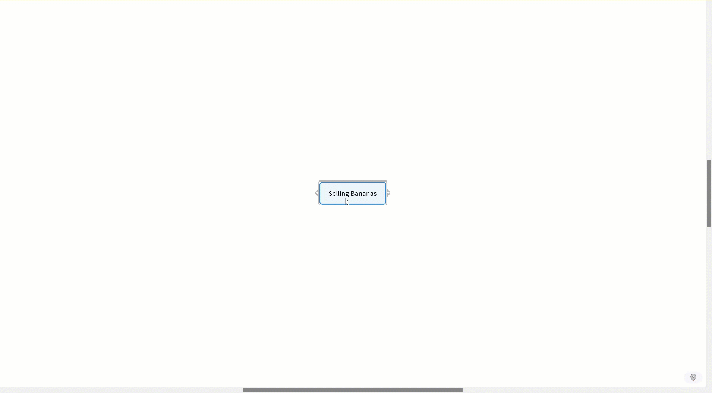
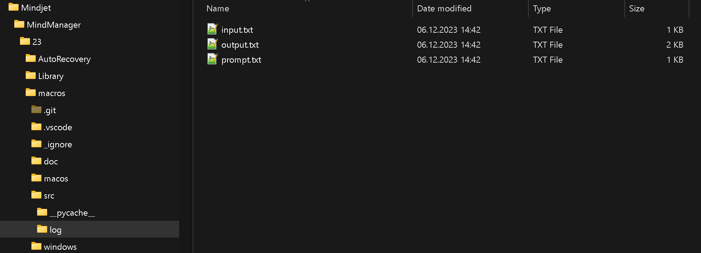
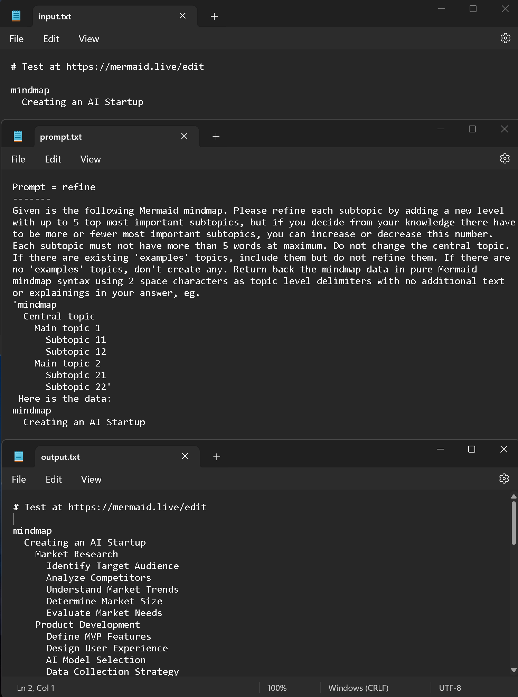
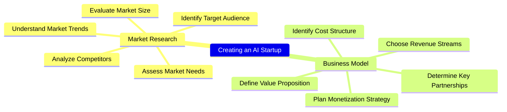

# MindManager Automation and LLM Integration

These automations and macros enhance mindmaps created by **MindManager** on macOS and Windows.

## Features

### Supported LLMs
  - **Azure OpenAI** w/ ***GPT-4o*** (use your key) -> **best tested**
  - **OpenAI** w/ ***GPT-4o*** (use your key) -> **best results**
  - **Anthropic** w/ ***Claude 3*** (use your key)  
  - **Groq** (platform) w/ ***LLama3*** (use your key)
  - **Perplexity** (platform) w/ ***LLama3*** (use your key)
  - **Google Gemini** w/ ***Pro*** and ***Flash*** (use your key)  
  - **Google Vertex AI** w/ ***Gemini Pro*** and ***Gemini Flash*** (use your access token)
  - **Ollama** (local) w/ any LLM (use ***LLama3***, ***Zephyr*** or ***Mixtral*** model for best results)
  - **MLX** (local w/ Apple Silicon) w/ any LLM (use ***LLama3*** model for best results)

### Platform
- Windows compatible (run macro/context menu or call the **Python** script directly)  
- macOS compatible (run **Automator** workflow (Quick Action) or call the **Python** script directly)  
- Just native LLM requests via API calls - **no middleware needed**

### Layout
- Map format can be radial map or orgchart
- Using map templates on macOS
- Map styles on Windows are persistent, automatic collapsing of nodes

## Implemented Business Cases
1. Refinement of the map or topic.  
2. Refinement of the map or topic from a development perspective.  
3. Create examples for one, more (selected) or all topics.  
4. Clustering topics from scratch.  
5. Clustering by one or more criterias eg. Organization/Process/Project/Expertise, Capex-Opex perspective.  
6. Complex cases (multiple calls): eg. refinement + clustering + examples.  

## Other Use Cases (implemented or easy to add)
- Export mindmap to Mermaid syntax or any other text format
- Change map layout by using a template (macOS)
- Reorder topics by business value or importance
- Translate the map to other languages
- Misspelling or syntax correction
- Create a map based on external text data

## Examples  
### Windows  
  

### macOS
  

## Installation  
### Windows  
Python has to be installed first (eg. using Chocolatey).  
Run `install.bat` or  
```
pip install --upgrade requests
pip install --upgrade pywin32
```
Macros can be registered directly by merging the `macro_registration.reg` to the registry. Hint: view order in MindManager is sorted by the GUIDs. All macros can then be executed using the context menu of topics (right mouse button click).  

  

Macros can also be executed by the Macro Editor. The macros are similar but the action parameter.  

  

### macOS  
Python has to be installed first (eg. using Homebrew).  
```
pip install --upgrade requests
pip install --upgrade appscript
```
Automator workflows can be copied to the Services folder by executing the `copy_to_services.sh` shell script. To make the script executable:
```
chmod +x ./copy_to_services.sh
```  

All **Automator** workflow settings are similar but the action parameter:  


The workflows are then available at the "MindManager" main menu -> Services  

  


## LLM systems
### Azure OpenAI / OpenAI
The solution ist best tested with `Azure OpenAI`. Results are perfect but slow for every use case. Execution time is far better with `OpenAI / GPT-4o`.  
### Google Gemini / Vertex AI
`Gemini Pro` results are good. `Gemini Flash` does (most of the time) only generate up to 3 levels at max, so a refinement does currently not work.  
### Ollama (hosted locally - no internet access needed)
Ollama results are dependent on the used model. `LLama3`, `Zephyr` and `Mixtral` are working well.  
### Anthropic Claude 3
Anthropic Claude 3 results are ogood. The OPUS model is a little bit expensive.
### groq (platform)
groq is sure the fastest LLM platform by now. Payment for API usage is still unclear because there is no way to set a payment method (as of 2024-05-05).  
### Perplexity (platform)
Perplexity works perfekt as an univeral LLM platform.  
### MLX (hosted locally on Apple Silicon - no internet access needed)
MLX results are dependent on the used model. `LLama3` works well.

## Configuration  
LLM Api relevant information should be stored in environment variables and mapped to the corresponding variables in the `config.py` file.    

```Python
# Azure serverless models, !use your model deployment name, ie. gpt-4o!
CLOUD_TYPE = 'AZURE+gpt-4o'                    # best
# CLOUD_TYPE = 'AZURE+gpt-4'                     # best
# CLOUD_TYPE = 'AZURE+gpt-4-32k'                 # best
# CLOUD_TYPE = 'AZURE+gpt-35'                    # best

# OpenAI
# CLOUD_TYPE = 'OPENAI+gpt-4o'                   # best
# CLOUD_TYPE = 'OPENAI+gpt-4-turbo'              # best
# CLOUD_TYPE = 'OPENAI+gpt-3.5-turbo'            # best

# Ollama (local models), best results
# CLOUD_TYPE = 'OLLAMA+mixtral'                  # best,        censored
# CLOUD_TYPE = 'OLLAMA+solar'                    # best,        uncensored
# CLOUD_TYPE = 'OLLAMA+mistral'                  # best,        uncensored
# CLOUD_TYPE = 'OLLAMA+openchat'                 # very good,   uncensored
# CLOUD_TYPE = 'OLLAMA+zephyr'                   # very good,   uncensored *
# CLOUD_TYPE = 'OLLAMA+neural-chat'              # good,        uncensored
# CLOUD_TYPE = 'OLLAMA+wizardlm2'                # very good,   uncensored (with warnings)
# CLOUD_TYPE = 'OLLAMA+llama3'                   # good,        uncensored
# CLOUD_TYPE = 'OLLAMA+llama3:70b'               # good,        censored, slow
# CLOUD_TYPE = 'OLLAMA+phi3'                     # good,        censored
# CLOUD_TYPE = 'OLLAMA+qwen2'                    # ok,          censored

# Google Gemini
# CLOUD_TYPE = 'GEMINI_PRO'                      # good
# CLOUD_TYPE = 'GEMINI_FLASH'                    # one-shot ok, generates maps only 3 levels deep

# Google Gemini Vertex AI (needs pre-authentication ie. token)
# CLOUD_TYPE = 'GEMINIPROJECT_PRO'               # good, Vertex AI need pre-authentication
# CLOUD_TYPE = 'GEMINIPROJECT_FLASH'             # one-shot ok, generates maps only 3 levels deep

# Claude3
# CLOUD_TYPE = 'CLAUDE3_OPUS'                    # good
# CLOUD_TYPE = 'CLAUDE3_SONNET'                  # good
# CLOUD_TYPE = 'CLAUDE3_HAIKU'                   # good

# groq
# CLOUD_TYPE = 'GROQ+mixtral-8x7b-32768'         # good
# CLOUD_TYPE = 'GROQ+llama3-8b-8192'             # good
# CLOUD_TYPE = 'GROQ+llama3-70b-8192'            # good
# CLOUD_TYPE = 'GROQ+gemma-7b-it'                # good

# Perplexity
# CLOUD_TYPE = 'PERPLEXITY+llama-3-8b-instruct'            # ok
# CLOUD_TYPE = 'PERPLEXITY+llama-3-70b-instruct'           # good
# CLOUD_TYPE = 'PERPLEXITY+llama-3-sonar-small-32k-chat'   # ok
# CLOUD_TYPE = 'PERPLEXITY+llama-3-sonar-large-32k-chat'   # good
# CLOUD_TYPE = 'PERPLEXITY+llama-3-sonar-small-32k-online' # reduced usability
# CLOUD_TYPE = 'PERPLEXITY+llama-3-sonar-large-32k-online' # good

# MLX server, macOS only (pip install mlx-lm)
# python -m mlx_lm.server --model mlx-community/Meta-Llama-3-8B-Instruct-4bit --port 8080 --log-level DEBUG
# CLOUD_TYPE = 'MLX+llama3-8b'                             # good


LLM_TEMPERATURE = float('0.5')

MAX_TOKENS = int('4000')
MAX_RETRIES = int('3')
TOP_MOST_RESULTS = int('5')
MAX_RETURN_WORDS = int('5')
LEVELS_DEEP = int('5')

INDENT_SIZE = int('2')
LINE_SEPARATOR = "\n"
OPENAI_COMPATIBILITY = False

if "OPENAI" in CLOUD_TYPE:
    OPENAI_COMPATIBILITY = True
    OPENAI_API_KEY = os.getenv('OPENAI_API_KEY_NATIVE')
    OPENAI_API_URL = "https://api.openai.com/v1/chat/completions"
    OPENAI_DEPLOYMENT = ""
    OPENAI_API_VERSION = ""

    OPENAI_MODEL = CLOUD_TYPE.split("+")[-1]
    API_URL = OPENAI_API_URL
    KEY_HEADER_TEXT = "Authorization"
    KEY_HEADER_VALUE = "Bearer " + OPENAI_API_KEY

elif "AZURE" in CLOUD_TYPE:
    OPENAI_DEPLOYMENT = CLOUD_TYPE.split("+")[-1]
    OPENAI_COMPATIBILITY = True
    OPENAI_API_KEY = os.getenv('OPENAI2_API_KEY')
    OPENAI_API_URL = os.getenv('OPENAI2_API_BASE')
    OPENAI_API_VERSION = os.getenv('OPENAI2_API_VERSION')

    OPENAI_MODEL = ""
    API_URL = f"{OPENAI_API_URL}openai/deployments/{OPENAI_DEPLOYMENT}/chat/completions?api-version={OPENAI_API_VERSION}"
    KEY_HEADER_TEXT = "api-key"
    KEY_HEADER_VALUE = OPENAI_API_KEY

elif "GEMINI" in CLOUD_TYPE:
    system = CLOUD_TYPE.split("_")[0]
    if system == "GEMINI":
        model = CLOUD_TYPE.split("_")[-1]
        if model == "PRO":
            MODEL_ID = "gemini-1.5-pro-latest"
        elif model == "FLASH":
            MODEL_ID = "gemini-1.5-flash-latest"
        else:
            raise Exception("Error: Unknown GEMINI model")

        GOOGLE_API_KEY = os.getenv('GOOGLE_API_KEY_AI')
        API_URL = f"https://generativelanguage.googleapis.com/v1beta/models/{MODEL_ID}:generateContent?key={GOOGLE_API_KEY}"
        KEY_HEADER_TEXT = ""
        KEY_HEADER_VALUE = ""
    elif system == "GEMINIPROJECT":
        # cloud.google.com/vertex-ai/docs/generative-ai/start/quickstarts/quickstart-multimodal
        # -> open console
        # gcloud auth print-access-token
        # (Service Account / Key -> Create new key -> JSON)
        # (gcloud auth activate-service-account --key-file=<path/to/your/keyfile.json>)
        model = CLOUD_TYPE.split("_")[-1]
        if model == "PRO":
            MODEL_ID = "gemini-1.5-pro-preview-0514"
        elif model == "FLASH":
            MODEL_ID = "gemini-1.5-flash-preview-0514"
        else:
            raise Exception("Error: Unknown GEMINI model")

        PROJECT_ID = os.getenv('GOOGLE_PROJECT_ID_AI')
        API_ENDPOINT="us-central1-aiplatform.googleapis.com"
        LOCATION_ID="us-central1"
        GOOGLE_ACCESS_TOKEN = os.getenv('GOOGLE_ACCESS_TOKEN_AI') # limited time use
        API_URL = f"https://{API_ENDPOINT}/v1beta1/projects/{PROJECT_ID}/locations/{LOCATION_ID}/publishers/google/models/{MODEL_ID}:generateContent"
        KEY_HEADER_TEXT = "Authorization"
        KEY_HEADER_VALUE = "Bearer " + GOOGLE_ACCESS_TOKEN
    else:
        raise Exception("Error: Unknown GEMINI system")

elif "OLLAMA" in CLOUD_TYPE:
    OPENAI_COMPATIBILITY = True
    MODEL_ID = CLOUD_TYPE.split("+")[-1]
    if OPENAI_COMPATIBILITY:
        API_URL="http://localhost:11434/v1/chat/completions"
    else: 
        API_URL="http://localhost:11434/api/generate"

elif "CLAUDE3" in CLOUD_TYPE:
    OPENAI_COMPATIBILITY = True
    model = CLOUD_TYPE.split("_")[-1]
    if model == "HAIKU":
        MODEL_ID = "claude-3-haiku-20240307"
    elif model == "SONNET":
        MODEL_ID = "claude-3-sonnet-20240229"
    elif model == "OPUS":
        MODEL_ID = "claude-3-opus-20240229"
    else:
        raise Exception("Error: Unknown CLAUDE3 model")
    ANTHROPIC_API_KEY = os.getenv('ANTHROPIC_API_KEY')
    ANTHROPIC_VERSION="2023-06-01"
    KEY_HEADER_TEXT = "x-api-key"
    KEY_HEADER_VALUE = ANTHROPIC_API_KEY
    API_URL="https://api.anthropic.com/v1/messages"

elif "GROQ" in CLOUD_TYPE:
    OPENAI_COMPATIBILITY = True
    MODEL_ID = CLOUD_TYPE.split("+")[-1]
    GROQ_API_KEY = os.getenv('GROQ_API_KEY')
    KEY_HEADER_TEXT = "Authorization"
    KEY_HEADER_VALUE = "Bearer " + GROQ_API_KEY
    API_URL="https://api.groq.com/openai/v1/chat/completions"

elif "PERPLEXITY" in CLOUD_TYPE:
    OPENAI_COMPATIBILITY = True
    MODEL_ID = CLOUD_TYPE.split("+")[-1]
    PERPLEXITY_API_KEY = os.getenv('PERPLEXITY_API_KEY')
    KEY_HEADER_TEXT = "Authorization"
    KEY_HEADER_VALUE = "Bearer " + PERPLEXITY_API_KEY
    API_URL="https://api.perplexity.ai/chat/completions"

elif "MLX" in CLOUD_TYPE:
    OPENAI_COMPATIBILITY = True
    MODEL_ID = CLOUD_TYPE.split("+")[-1] # not used, depends on how the server was started
    API_URL="http://localhost:8080/v1/chat/completions"
```

## Prompt crafting  
Prompt crafting is lightly implemented using the following strategy:  

  

## Platform specific implementations
### Windows  
MindManager COM objects are addressed by using the PyWin32 library:  


### macOS  
MindManager objects are addressed by using the AppScript library:  


## Implementation details  
The Mermaid mindmap syntax is used when talking to the OpenAI LLM as an intermediate "language". Log file contents for input, output, prompt can be used in other use cases eg. mindmap visualizations in GitHub markdown files.  

  

Log files content:  



Example using a Mermaid mindmap in a GitHub markdown file.  
Code:
```


Github rendering of the map:



You can also use the content inside the Mermaid online editor (https://mermaid.live/edit):  

  


## Disclaimer
The API execution time depends heavily on the used LLM model or system and token count.  

Currently, this project is in the early development phase, and generated outputs may include errors. Automated testing has not yet been implemented.  
