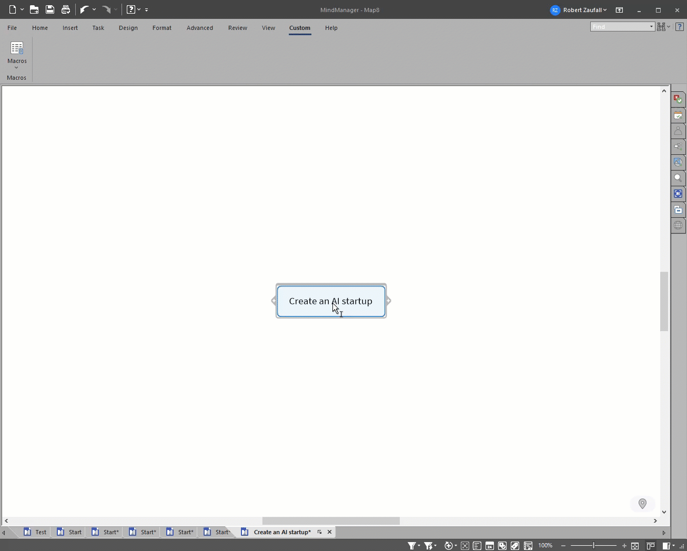

# Mindjet Mindmanager Macros for OpenAI Integration

These macros enhance mindmaps created by **Mindjet Mindmanager**.

## Features

- Written in **Win Wrap Basic**.
- Utilizes the **OpenAI REST Api** at OpenAI or Azure OpenAI for generation.
- Configuration for OpenAI Api can be found and modified in `settings.cls`.

## Implemented Use Cases

1. Create subtasks for a topic.
2. Create examples for a topic.
3. Refinement of the map.
4. Deep refinement of the central topic or map.
5. Map translation
6. Export to Mermaid syntax

## Example

## Disclaimer

This project is in its early stages. Generation might still contain errors. If you encounter an error, please try calling the macro again.
