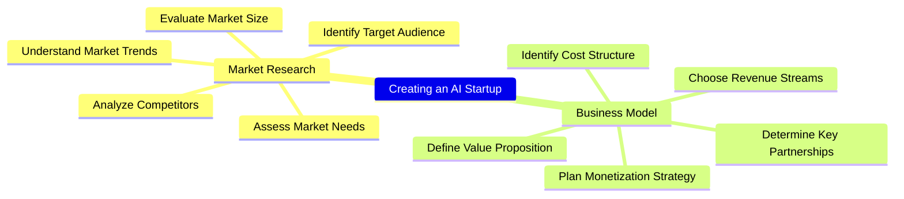

# MindManager automation and LLM / AI Integration Windows + macOS

These automations and macros enhance mindmaps created by **MindManager** on macOS and Windows.

## Windows  
  

## macOS  
  

Remark: Image generation with DALL-E-3 or SD3 needs far more time than in these animations.  
More animated examples are in the `doc` folder.

## Features

### Supported LLMs
  - **Azure OpenAI** w/ ***GPT-4o*** (use your key) -> **best tested**
  - **OpenAI** w/ ***GPT-4o*** (use your key) -> **best results**
  - **Anthropic** w/ ***Claude 3*** (use your key)  
  - **Groq** (platform) w/ ***LLama3*** (use your key)
  - **Perplexity** (platform) w/ ***LLama3*** (use your key)
  - **Google Gemini** w/ ***Pro*** and ***Flash*** (use your key)  
  - **Google Vertex AI** w/ ***Gemini Pro*** and ***Gemini Flash*** (use your access token)
  - **Ollama** (local) w/ any LLM (use ***LLama3***, ***Zephyr*** or ***Mixtral*** model for best results)
  - **MLX** (local w/ Apple Silicon) w/ any LLM (use ***LLama3*** model for best results)

### Supported Image Generation Systems
  - **Azure OpenAI** w/ ***DALL-E-3*** (use your key) -> **best tested**
  - **OpenAI** w/ ***DALL-E-3*** (use your key) -> **best results**
  - **Stability AI** w/ ***Stable Diffusion 3 / Ultra / Core*** (use your key)  

### Platform
- Windows compatible (run macro/context menu or call the **Python** script directly)  
- macOS compatible (run **Automator** workflow (Quick Action) or call the **Python** script directly)  
- Just native LLM requests via API calls - **no middleware needed**

### Layout
- Map format can be radial map or orgchart
- Using map templates on macOS
- Map styles on Windows are persistent, automatic collapsing of nodes

## Implemented Business or Use Cases
1. Refinement of the map or topic.  
2. Refinement of the map or topic from a development perspective.  
3. Create examples for one, more (selected) or all topics.  
4. Clustering topics from scratch.  
5. Clustering by one or more criterias eg. Organization/Process/Project/Expertise, Capex-Opex perspective.  
6. Complex cases (multiple calls): eg. refinement + clustering + examples.  
7. Image generation with DALL-E-3 or SD3 from topics (use copy/paste after generation)

## Other Use Cases (implemented or easy to add)
- Export mindmap to Mermaid syntax or any other text format
- Change map layout by using a template (macOS)
- Reorder topics by business value or importance
- Translate the map to other languages
- Misspelling or syntax correction
- Create a map based on external text data

## Installation  
### Windows  
First install the Windows package manager **Chocolatey** from an administration shell or choose any other way following https://chocolatey.org/install.  
This is one line:  
```
Set-ExecutionPolicy Bypass -Scope Process -Force; [System.Net.ServicePointManager]::SecurityProtocol = [System.Net.ServicePointManager]::SecurityProtocol -bor 3072; iex ((New-Object System.Net.WebClient).DownloadString('https://community.chocolatey.org/install.ps1'))
```  
Change to folder `%localappdata%\Mindjet\MindManager\23\macros`:
```
cd %localappdata%\Mindjet\MindManager\23\macros
```
Copy all files from the GitHub repository to this location.  
Change to `windows` folder:
```
cd windows
```
Run `install.bat` or  the following commands:
```
choco install python3
pip install --upgrade requests
pip install --upgrade pywin32
pip install --upgrade Pillow
pip install --upgrade httpx
powershell -ExecutionPolicy Bypass -File .\macro_registration.ps1
```
Check in registry and MindManager, if the macros are available (right click on topic).  
Hint: The macro list is ordered according to the GUID-string, not the macro name.   

  

Macros can also be executed by the macro editor. The macros are similar but the action parameter.  

  

You can also check here if the path to the python files is correct.  

### macOS  
Python has to be installed first. Go to https://www.python.org/downloads/macos/ and download the desired installer.  
Install required python libraries:
```
pip install --upgrade requests
pip install --upgrade appscript
pip install --upgrade Pillow
pip install --upgrade httpx
```
Create the directory structure `~/git/mindmanager_ai` with Terminal:
```
cd ~/
mkdir git
cd git
mkdir mindmanager_ai
cd mindmanager_ai
```
Copy all repository files to this location as the Automator workflows contain this path.  
Alternatively you can clone the repository in Terminal:  
```
cd ~/
mkdir git
cd git
git clone https://github.com/robertZaufall/mindmanager_ai.git
cd mindmanager_ai
```
Change to folder `macos` and copy the Automator workflows to the `~/Library/Services` (hidden) folder:
```
cd macos/automator
chmod +x ./copy_to_services.sh
./copy_to_services.sh
```
If you need elevated privileges for copying the files use this command:
```
sudo sh ./copy_to_services.sh
```
All **Automator** workflow settings are similar but the action parameter:  

  

The workflows are then available at the "MindManager" main menu -> Services  

  

### VSCode

I prefer to execute the python script directly from VSCode. Here you can easily adjust the settings, try different LLMs on the fly and even debug, if problems occur (external systems are sometimes not available).

## How to use  
### Configuration  
First of all you have to open the `config.py` in a text editor of your choice.  
Use the apropriate LLM system for which you have an API key. These keys are available on the developer platforms of the AI vendors.  
If you want to run local models with Ollama or GPT4All you have to have either a newer Apple Mac model with M1, M2, M3 processor or a desktop or notebook with NVidia graphic card with at least 8GB graphic ram.  

### General
You can have more than one open document in MindManager. The document which should be processed musst be the active document. For every processing a new document with the new topics will be created.  

To process the whole map, select the central topic (for right-clicking) or no topic at all (call macro manually (Windows), choose Automator Workflow from Mindmanager Menu -> Services or call the python script from VSCode or commandline `python3 process.py <action> <format>`.  

Examples for commandline activation:
```
cd ~/git/mindmanager_ai/src

python3 process.py refine             # first refinement
python3 process.py refine radial      # second refinement and radial chart layout
python3 process.py finalize orgchart  # just change format to organizational chart layout (on macOS there is no other way)
python3 process.py capex_opex radial  # restructure the whole map to cluster capex and opex relevant topics

# for image generation select relevant topics first or the central topic is chosen
python3 process.py image
```

### Map actions
Select the central topic or deselect all topics and call the activation.  
You can also select one or more topics and start the automation for just these topics, e.g. to generate examples for these topics, refine just these topics etc.  

### Image generation
Just select the topics for which you want to generate an image and choose the action "Generate Image" (macro on Windows or Automator Workflow on macOS) or call the Python script with parameter `image`.  
After a little while, the image will be opened and also stored in the `src/images` folder.  
Unfortunately, on macOS the image cannot automatically be inserted into the map or added to a topic due to insufficient library support. For Windows I have to look into this topic first.   
The results from the generation process are good with DALL-E-3 and sometimes not as good with Stable Diffusion. Prompt crafting/engineering is still in progress.  
For Stable Diffusion the filename is enriched with the generation **seed**. This seed is useful if you want to generate similar images (e.g. with different prompt.). DALL-E-3 does not support a seed value anymore (by the time of writing).  

## LLM systems
### Azure OpenAI / OpenAI
The solution ist best tested with `Azure OpenAI`. Results are perfect but slow for every use case. Execution time is far better with `OpenAI / GPT-4o`.  
### Google Gemini / Vertex AI
`Gemini Pro` results are good. `Gemini Flash` does (most of the time) only generate up to 3 levels at max, so a refinement does currently not work.  
### Ollama (hosted locally - no internet access needed)
Ollama results are dependent on the used model. `LLama3`, `Zephyr` and `Mixtral` are working well.  
### Anthropic Claude 3
Anthropic Claude 3 results are ogood. The OPUS model is a little bit expensive.
### groq (platform)
groq is sure the fastest LLM platform by now. Payment for API usage is still unclear because there is no way to set a payment method (as of 2024-05-05).  
### Perplexity (platform)
Perplexity works perfekt as an univeral LLM platform.  
### MLX (hosted locally on Apple Silicon - no internet access needed)
MLX results are dependent on the used model. `LLama3` works well.

## Configuration  
All configuration is stored in the `config.py` file. Security relevant information should be mapped using environment variables.  
Don't be overwhelmed by the huge list of variables. Just pick the lines you need and set its values  

## Prompt crafting  
Prompt crafting is lightly implemented using the following strategy:  

  

## Platform specific implementations
### Windows  
MindManager COM objects are addressed by using the PyWin32 library:  


### macOS  
MindManager objects are addressed by using the AppScript library:  


## Implementation details  
The Mermaid mindmap syntax is used when talking to the OpenAI LLM as an intermediate "language". Log file contents for input, output, prompt can be used in other use cases eg. mindmap visualizations in GitHub markdown files.  

  

Log files content:  


Example using a Mermaid mindmap in a GitHub markdown file.  
Code:
```


Github rendering of the map:



You can also use the content inside the Mermaid online editor (https://mermaid.live/edit):  

  


## Disclaimer
The API execution time depends heavily on the used LLM model or system and token count.  

Currently, this project is in the early development phase, and generated outputs may include errors. Automated testing has not yet been implemented.  

## More Examples

  

  

  

