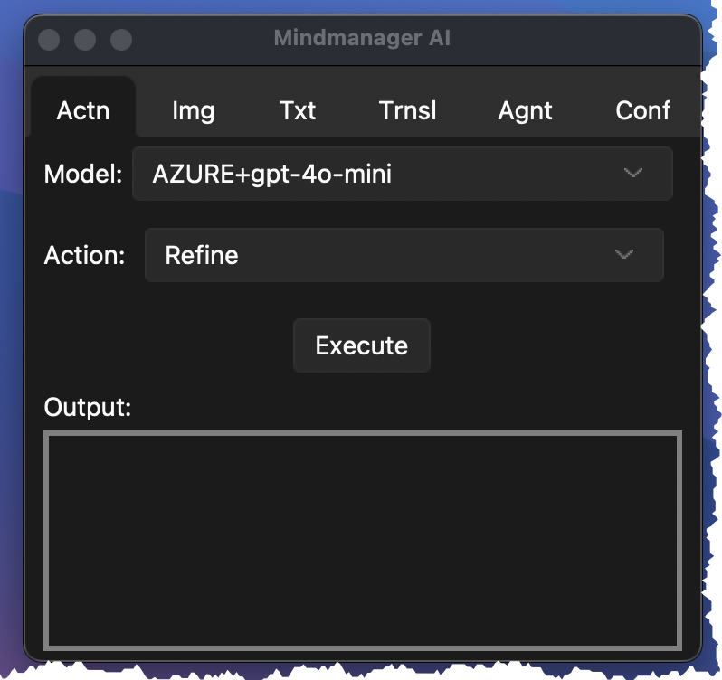
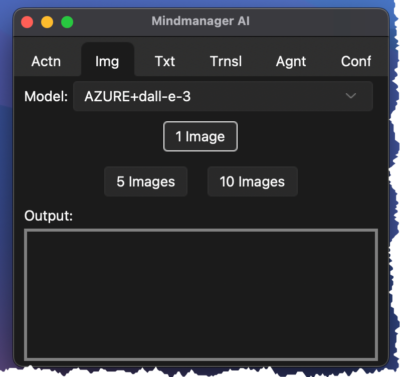
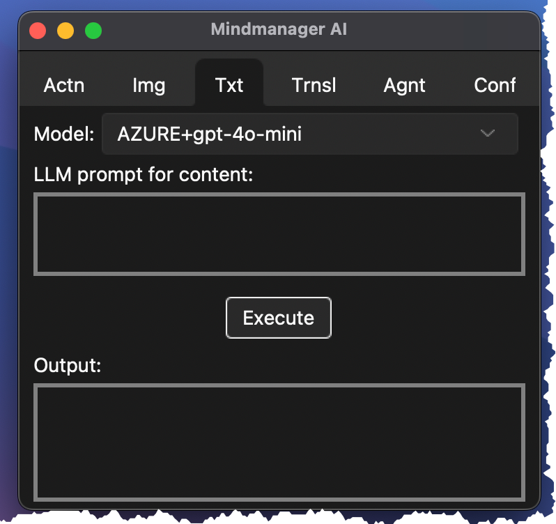
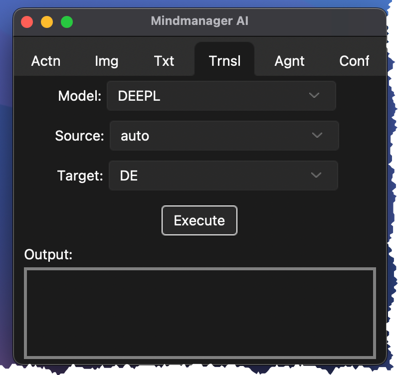
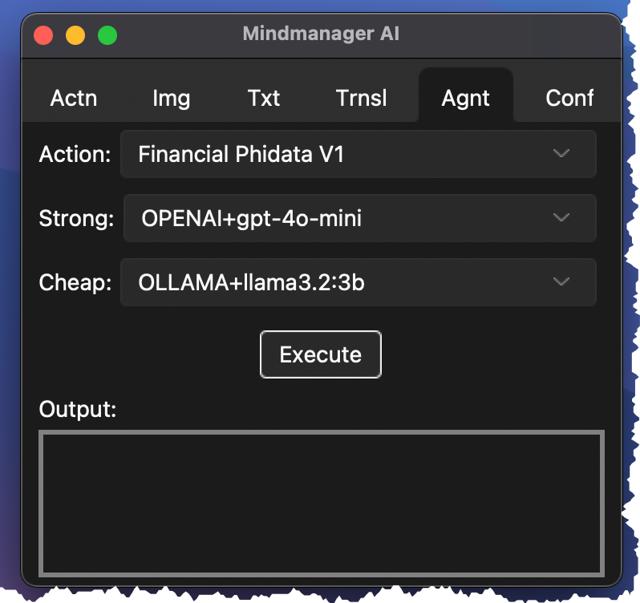
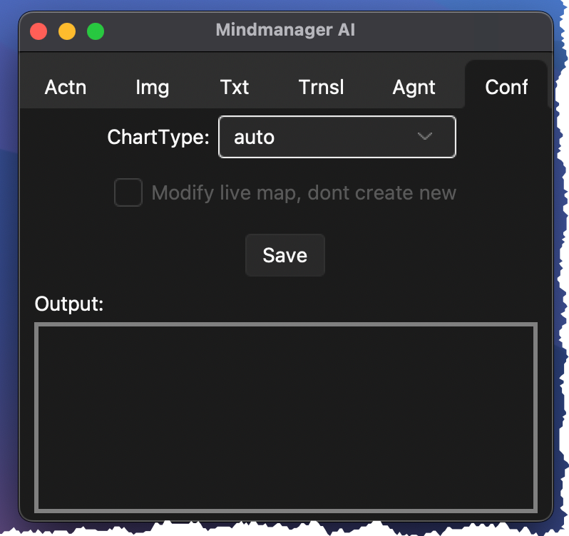
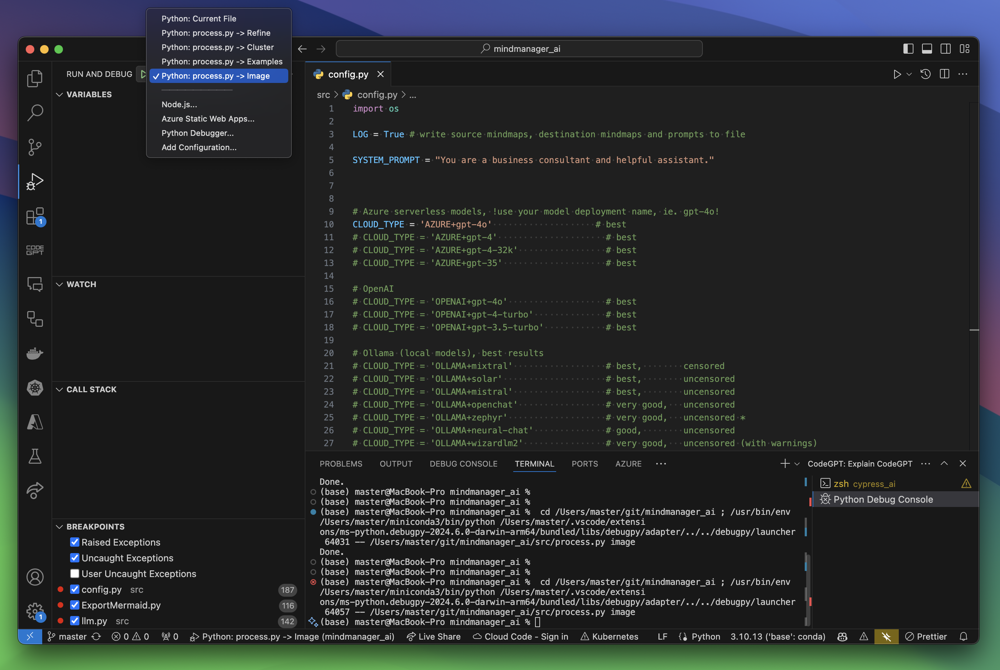
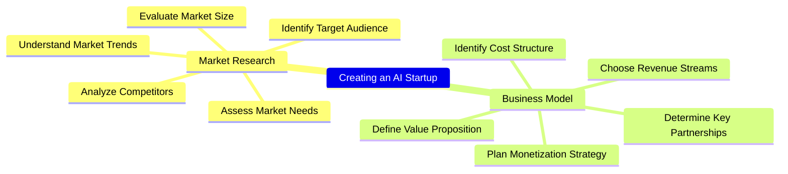

# MindManager AI Integration <br/> Windows + macOS

These automations and macros enhance mindmaps created by **MindManager** on macOS and Windows.

## Windows  

Using MindManager Macro:  

  

## macOS  

Using Automator Workflow (Quick Action):  

  

Using Tkinter UI and "Freetext" option (run the `app_tkinter.py` file):  

  

More animated examples are in the `doc` folder.

## Features

### AI platforms and LLMs
  - **Azure OpenAI** w/ `GPT` and `o` models (use your key or log in with `Azure Entra ID`)  
  - **OpenAI** w/ `GPT` and `o` models (use your key)  
  - **Anthropic** w/ `Claude` models (use your key)  
  - **xAI** w/ `grok` models (use your key)  
  - **Google Gemini** w/ `Gemini`, `Gemma` models (use your key)  
  - **Google Vertex AI** w/ `Gemini` models (use your access token / OAuth2)
  - **DeepSeek** w/ `DeepSeek` models (use your key)  
  - **Alibaba Cloud** w/ `Qwen` models (use your key)  
  - **Mistral AI** w/ `Mistral` models (use your key)
  - **AWS Bedrock** w/ `Nova` native models or `Anthropic`, `Mistral` serverless models (use your key + secret)  
  - **Azure AI Foundry** (platform)  w/ `LLaMA`, `Mistral` etc. (use your key)  
  - **Groq** (platform) w/ `OpenAI GPT-OSS`, `Gwen3`, `DeepSeek-R1`, `Kimi-K2`, `LLaMA3` etc. (use your key)  
  - **STACKIT (Schwarz Gruppe)** (platform) w/ `LLaMA` (use your key)  
  - **Fireworks AI** (platform)  w/ `LLaMA`, `Qwen` etc. (use your key)  
  - **Cerebras** (platform)  w/ `GPT-OSS`, `Qwen` etc. (use your key)  
  - **Perplexity** (platform) w/ `Sonar` models etc. (use your key)  
  - **Hugging Face** (platform)  w/ `LLaMA` and more models (use your token)  
  - **GitHub Models** (platform) w/ OpenAI `GPT`, `o`, META `LLaMA` models etc. (use your key)  
  - **OpenRouter** (platform) w/ many/all models (use your key)
  - **GPT4ALL** (local w/ SDK) w/ any `llama.cpp` model
  - **Ollama** (local w/ API) w/ any `llama.cpp` or `MLX` model
  - **LMStudio** (local w/ API) w/ any `llama.cpp` or `MLX` model
  - **MLX** (local w/ API, Apple Silicon) w/ any `MLX` model

### Image Generation
  - **Azure OpenAI** w/ `gpt-image-1`, `DALL-E 3`, `Flux Pro 1.1`, `Flux.1 Kontext Pro` (use your key or log in with `Azure Entra ID`)  
  - **OpenAI** w/ `gpt-image-1`, `DALL-E 3` (use your key)
  - **Stability AI** w/ `Stable Diffusion 3` `SD3.5` / `SD3` / `Ultra` / `Core` (use your key)  
  - **Google Vertex AI** w/ `Gemini Flash 2.5` (nano banana),`Imagen3` (use your access token / OAuth2, GCP approval required!)  
  - **Ideogram AI** w/ `V1` / `V2` (use your key)  
  - **Black Forest Labs** w/ `Flux Pro 1.1 Ultra`, `Flux Pro 1.1`, `Flux.1 Pro`, `Flux.1 Dev`, `Flux.1 Kontext Pro/Max`  (use your key)  
  - **Recraft AI** w/ `RecraftV3`, `Recraft20B` (use your token)  
  - **Alibaba Cloud** w/ `Qwen Wan 2.2` models
  - **MLX** (local w/ SDK, Apple Silicon) w/ `Flux` models

### Video Generation
  - **Azure OpenAI** w/ `Sora`, `Sora 2` (use your key)  
  - **Google Vertex AI** w/ `Veo 3.1`, `Veo 3`, `Veo 2` (use your access token / OAuth2)  

### Translation Services
 - **DeepL** (use your key)

### Agentic Framework Examples  
  - **Agno** (formerly "Phidata")  
  - **Autogen** (Microsoft)  
  - **CrewAI**  

### Platform
- Windows compatible (run macro/context menu or call the **Python** script directly)  
- macOS compatible (run **Automator** workflow (Quick Action) or call the **Python** script directly)  
- Only native API requests to AI systems - **no middleware needed**

### Layout
- Map format can be radial map or orgchart
- Using map templates on macOS
- Map styles on Windows are persistent, automatic collapsing of nodes

## Implemented Business or Use Cases
1. Refinement of the map or topic.  
2. Refinement of the map or topic from a development perspective.  
3. Create examples for one, more (selected) or all topics.  
4. Clustering topics from scratch.  
5. Clustering by one or more criteria (e.g., Organization/Process/Project/Expertise, Capex–Opex perspective).  
6. Complex cases (multiple calls): eg. refinement + clustering + examples.  
7. Image generation from topics
8. Professional translation of all topics by DeepL
9. Export `Mermaid` mindmap HTML document
10. Export `Markmap` mindmap HTML document
11. PDF to mindmap (multiple files / batch processing)
12. Generate a working paper (argumentation) HTML document for a detailed mindmap
13. Generate a glossary HTML document of all terms
  
  

## Other Use Cases (implemented or easy to add)
- Export mindmap to any other text format
- Change map layout by using a template (macOS)
- Reorder topics by business value or importance
- Misspelling or syntax correction
- Create a map based on external text data

## User Interface  
There's a new user interface using Tkinter to execute most operations and more. The app stays always on top and has several UI tabs:  
  
### Action tab  
Choose the desired model and action and click on execute:
  
  
  
### Image tab  
Choose the desired model and the number of images to generate:

  
  
### Freetext tab  
Choose the desired model, enter text describing how to generate or modify the content, and click Execute.  
Examples:  
- "refine"
- "translate all topics to German"
- "add an emoji to every topic" (only works on macOS)

  
  
### Translation tab  
Choose the destination language and click Execute:

  
  
### Agent tab  
Choose an already implemented agent and the desired models.  
The agents list is generated from scripts found in the `ai/agents` folder.  
Before execution, the required libraries must be installed:  
`pip install -r requirements_agents.txt`.  
CrewAI does not install well on Windows ARM64 at the time of writing.  
Agents make many AI round-trip calls, so costs should be monitored.
  
  
  
### Configuration tab  
Currently, only the resulting chart format is selectable (orgchart, radial, or automatic):  
  
  
  
## Installation  
### Windows  
First install the Windows package manager `Chocolatey` from an administrative shell or choose any other way following https://chocolatey.org/install.  
This is one line:  
```
Set-ExecutionPolicy Bypass -Scope Process -Force; [System.Net.ServicePointManager]::SecurityProtocol = [System.Net.ServicePointManager]::SecurityProtocol -bor 3072; iex ((New-Object System.Net.WebClient).DownloadString('https://community.chocolatey.org/install.ps1'))
```  
Change to folder `%localappdata%\Mindjet\MindManager\23\macros` (user your version number!):
```
cd %localappdata%\Mindjet\MindManager\23\macros
```
Copy all files from the GitHub repository to this location.  
Change to `windows` folder:
```
cd windows
```
Run `install.bat` or the following commands (requirements_auth.txt only if you want to use `Azure Entra ID` or `GCP OAuth2`):
```
cd ..
choco install python3
pip install -U -r .\src\requirements.txt
pip install -r .\src\requirements_auth.txt
powershell -ExecutionPolicy Bypass -File .\windows\macro_registration.ps1
```
Check in the registry and MindManager if the macro is available (right‑click on a topic).  
Hint: The macro list is ordered according to the GUID string, not the macro name.   

  

The macro can also be executed from the macro editor.  

  

You can also check here if the path to the Python file is correct.  

### macOS  
Python has to be installed first. Go to https://www.python.org/downloads/macos/ and download the desired installer.  
Install required Python libraries (requirements_auth.txt only if you want to use `Azure Entra ID` or `GCP OAuth2`, requirements_mac_mlx.txt is only needed for local image generation using MLX):
```
pip install -U -r requirements.txt
pip install -r requirements_mac_mlx.txt
pip install -r requirements_auth.txt
```
Create the directory structure `~/git/mindmanager_ai` with Terminal:
```
cd ~/
mkdir git
cd git
mkdir mindmanager_ai
cd mindmanager_ai
```
Copy all repository files to this location as the Automator workflows contain this path.  
Alternatively, you can clone the repository in Terminal:  
```
cd ~/
mkdir git
cd git
git clone https://github.com/robertZaufall/mindmanager_ai.git
cd mindmanager_ai
```
Change to folder `macos` and copy the Automator workflow to the `~/Library/Services` (hidden) folder:
```
cd macos/automator
chmod +x ./copy_to_services.sh
./copy_to_services.sh
```
If you need elevated privileges for copying the files, use this command:
```
sudo sh ./copy_to_services.sh
```
The **Automator** workflow settings:  

  

The workflow is then available in the "MindManager" main menu -> Services  

  

### VSCode

I prefer to execute the Python script directly from VSCode. Here you can easily adjust settings, try different LLMs on the fly, and debug if problems occur (external systems are sometimes not available).  
Some actions are already predefined for quick execution.  

  

## How to use  
### Configuration  
There are main configuration files for LLMs, image generation, and translation.
Open each config file and uncomment the AI model you want to use. The `config` folder contains environment files for every supported AI provider. For example, if you want to use OpenAI models, copy `config/openai.env.example` to `config/openai.env` and fill in your API key.  
Use the appropriate LLM system for which you have an API key. These keys are available on the developer platforms of the AI vendors.  
If you want to run local models with `Ollama`, `GPT4All`, `LMStudio`, or `MLX`, you need either a newer Apple Mac model with an M1–M4 processor or a desktop/notebook with an NVIDIA graphics card with at least 8 GB of VRAM.  

### General
You can have more than one open document in MindManager. The document which should be processed must be the active document. For every processing a new document with the new topics will be created.  

To process the whole map, select the central topic (for right‑clicking) or don't select any topic and call a macro manually (Windows), choose Automator Workflow from MindManager Menu -> Services, or call the Python script from VSCode or the command line: `python3 process.py <action> <format>`. If it doesn't work, try `python3` or `python`.  

### Map actions
Select the central topic or deselect all topics and call the automation.  
You can also select one or more topics and start the automation for just these topics, e.g. to generate examples for these topics, refine just these topics etc.  

### Image / Video generation
Just select the topics for which you want to generate an image and choose the action "Generate Image" (macro on Windows or Automator Workflow on macOS) or call the Python script with parameter `image` or `image_n`.  
After a while, the image will open and also be stored in the MindManager library `Images` folder.  
Unfortunately, on macOS the image cannot automatically be inserted into the map or added to a topic due to insufficient library support.  
On Windows the image can be automatically set as the background image of the map.  

The results from the generation process are best with `FLUX.1`, good with `DALL-E 3` and `SD 3.5`. Prompt crafting/engineering is still in progress.  
The filename includes the generation **seed** where this feature is supported. This seed is useful if you want to generate similar images (e.g., with a different prompt). `DALL-E 3` does not support a seed value anymore (at the time of writing).  
The prompt for image generation can optionally be optimized using an LLM call.
Images can also be generated locally on macOS with Apple Silicon using the native `Apple MLX` framework.  

Recently, more image‑generation platforms have emerged. `Black Forest Labs`, `Ideogram AI`, and `Recraft AI` image generation from mindmaps is already implemented and the results are excellent.  

Video generation works with `Sora` (Azure OpenAI) and `Veo` (Google Vertex AI).  

### Generation using text summarization (e.g., PDF to mindmap)
Put the files into the `input`-folder and use the action `pdf_mindmap`. The PDF files are first converted to markdown (MD) format. 'Reference' sections are removed as these contain no information but take a lot of tokens (e.g. arXiv papers). No OCR takes place by now. Tables are removed and the content will be highly sanitized by removing irrelevant characters, code blocks, href-links, whitespace etc.  
Ollama‑based local LLMs are not working for me yet.  

Some models (e.g., `Sonnet`) support native `PDF` processing, which is also implemented (action `pdfsimple_mindmap`).  

### Text generation from mindmaps (working paper (argumentation), glossary)
Generating larger text outputs requires a model with a higher max‑token limit (e.g., `GPT-4o`, `Gemini Flash`, `Sonnet`). Results are very good most of the time. 

## LLM systems
### Azure OpenAI / OpenAI
The solution is best tested with `Azure OpenAI`. Results are perfect for most use cases.  
Azure Entra ID authentication can be used in enterprise scenarios.  
### Google Gemini / Vertex AI
`Gemini Pro` results are best. `Gemini Flash` is also very good.  
Vertex AI needs a security token, which you can generate using the Cloud Console.  
### Anthropic Claude
The `Sonnet` model is very good, `Haiku` is good and also very cheap, `Opus` the most expensive.  
### xAI grok
Grok is very good and can refine mindmaps across several levels. The models `grok-3` and `grok-2-vision-1212` are very good. The vision model can be used for PDF OCR. `grok-4` takes some time.  
### Amazon Bedrock
Amazon Bedrock has native models (e.g., `Nova`) and also hosts third‑party models from `Anthropic Claude` and `Mistral`.
### DeepSeek
DeepSeek created an extraordinary open‑source model, DeepSeek V3. The reasoning model `r1` does not work yet.  
### Alibaba Cloud
Alibaba Cloud models cannot generate large amounts of tokens (`Qwen-Max`: 2000, `Qwen-Plus` + `Qwen-Turbo`: 1500) but the results are good. `Qwen-Turbo` is very fast.  
### Mistral AI
Mistral AI hosts their commercial flagship models `Mixtral-Large` and `Pixtral-Large`. `Mixtral-Large` is a 'best in class' model. The maximum number of possible output tokens is a little unclear (max_tokens may be the sum of input and output tokens).  
### Groq (platform)
Groq is one of the fastest LLM hosting platforms. `OpenAI GPT-OSS`, `Gwen3`, `DeepSeek-R1`, `Kimi-K2`, `LLaMA3` and other models are available. From time to time the supported models on the platform are changing.  
### Cerebras (platform)
Cerebras hosts `OpenAI GPT-OSS`, `Gwen3`, `DeepSeek-R1`, `LLaMA3` and other models at high inference speeds. From time to time the supported models on the platform change.  
### Perplexity (platform)
Perplexity hosts its own `Sonar` models. From time to time the supported models on the platform are changing.  
### Hugging Face (platform)
To access better models a pro subscription is needed. `LLaMA-3-8B` can still be used.  
### OpenRouter (platform)  
On the OpenRouter platform there are a variety of models and systems available. Fallback scenarios are supported. You also get access to the newest OpenAI models like `o1-preview`.  
### GPT4ALL, Ollama, LMStudio (hosted locally - no internet access needed)
Results depend on the model used. `LLaMA3`, `Zephyr`, and `Mixtral` work well.  
### MLX (hosted locally on Apple Silicon - no internet access needed)
MLX results depend on the model used. `LLaMA3` works well.

## Image / Video generation systems  
### Azure OpenAI / OpenAI - DALL-E 3, FLUX.1, GPT-image-1, Sora  
The solution is best tested with `Azure OpenAI`. Results are very good. There are issues with text generated in images. Azure Entra ID authentication can be used in enterprise scenarios.  
### Stability AI - Stable Diffusion 3 + 3.5  
Image generation with `SD3.5` and `SD3` is the most flexible, as you can use a seed value, negative prompt, etc. Prompt engineering is most important here, as the results are far from being perfect by now.  
### Google Vertex AI - Imagen3, Veo 3  
Image generation results are too simple by now as prompt engineering is also most important here. `Imagen3` has the highest image resolution (1:1 with 1536x1536). `Imagen3` is GA (globally available) but there is an approval process to get access to the API.  
### Ideogram AI  
Image generation is quite good using the `V2` model. When activating API access, keep in mind that generating an API key immediately results in a $40 bill.  
### Black Forest Labs  
Image generation is extraordinary. The flagship model is `Flux Pro 1.1 / Ultra`. As usual, tokens must be prepaid and you need to be accepted to access the platform.  
### Recraft.AI
Image generation is very good. There are many pre‑defined styles which can be activated as needed. Available models are `RecraftV3` and `Recraft20B`.  

### MLX w/ Flux models
This local image generation alternative is only available on macOS with Apple Silicon processors like M1 and higher. The results are above average using the `Flux` models.  

Using the `image_n` action (e.g., `image_10`) generates a batch of images in a row. A pre‑execution step can optimize the prompt using an LLM call. If only one topic is selected a different prompt is used than when multiple topics are selected. Only the first‑level topics together with the central topic should be selected for better results.  

When using this image‑generation approach, the desired model and embeddings tokenizer are downloaded automatically. The expected download size is up to 70 GB.  
If you are downloading for the first time, you may have to log in at **Hugging Face** with your token first to agree to their terms of model usage: `huggingface-cli login --token <xyz>`. Downloaded models are cached at `~/.cache/huggingface`.

## Translation systems
### DeepL
Translation works for these languages:
```
# supported languages as source
# BG,CS,DA,DE,EL,EN,ES,ET,FI,FR,HU,ID,IT,JA,KO,LT,LV,NB,NL,PL,PT,RO,RU,SK,SL,SV,TR,UK,ZH

# supported languages as target
# BG,CS,DA,DE,EL,EN-GB,EN-US,ES,ET,FI,FR,HU,ID,IT,JA,KO,LT,LV,NB,NL,PL,PT-BR,PT-PT,RO,RU,SK,SL,SV,TR,UK,ZH
```
Source language will be detected automatically. `Formality` parameter is not supported for all languages, so it is disabled by now. `Context` parameter was not used as DeepL states it's deprecated.
API requests point to the free tier. If you have a paid subscription change the URL in the `config.py`.

## Agentic frameworks (to be replaced by MCP soon) 
There are only some example implementations using agentic frameworks. Results are requested as markdown code from the agents and are transformed to Mermaid mindmap by another LLM call. This should be addressed soon.  

### Agno (formerly Phidata)  
https://github.com/agno-agi/agno  
Mighty but very performant and easy to use framework.  

### Autogen (Microsoft)  
https://github.com/microsoft/autogen  
Framework is complex and not so easy to use. There is also a fork with a similar name `pyautogen`, renamed as AG2.  

### CrewAI  
https://github.com/crewAIInc/crewAI  
Mighty and complex framework. Installation on Windows 11 on ARM requires VS2022 build tools. Installation on macOS seems to be easier but still has many dependencies.  

## Context engineering / Prompt crafting  
Strategy:  

  

## Platform specific implementations
The `mindm` component is used on both platforms for MindManager automation.  
[Link to GitHub Repository](https://github.com/robertzaufall/mindm/)  
[Link to GitHub Pages](https://robertzaufall.github.io/mindm/)  

### Windows  
MindManager COM objects are addressed by using the PyWin32 library:  


### macOS  
MindManager objects are addressed by using AppleScript or the AppScript library:  


The behaviour can be switched in the config-files: `"appscript"` vs. `"applescript"`.  

## Implementation details  
The Mermaid mindmap syntax is used when talking to the OpenAI LLM as an intermediate "language". Log file contents for input, output, prompt can be used in other use cases eg. mindmap visualizations in GitHub markdown files.  

  

Log file contents:  


Example using a Mermaid mindmap in a GitHub markdown file.  
Code:
```


GitHub rendering of the map:



You can also use the content inside the Mermaid online editor (https://mermaid.live/edit):  

  

Remarks:  
The Mermaid layer will be replaced by structured output using extended Mermaid syntax or JSON in the future.  

## Disclaimer
Currently, this project is in the early development phase, and generated outputs may include errors. Automated testing has not yet been implemented.  
