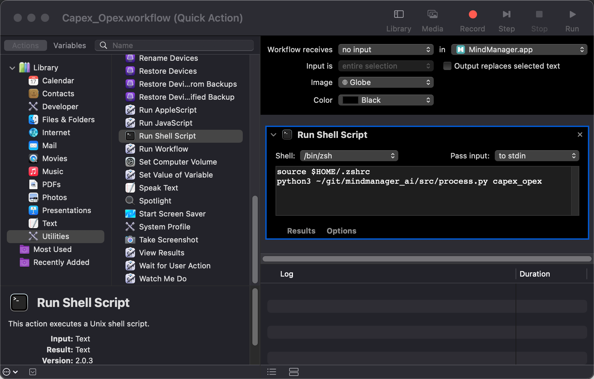
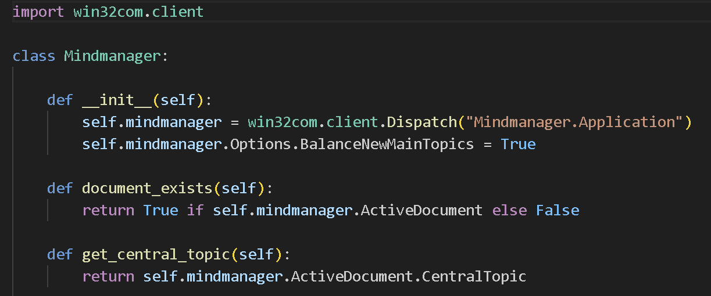

# Mindjet Mindmanager automation and LLM Integration

These automations and macros enhance mindmaps created by **Mindjet Mindmanager**.

## Features

- Supported LLMs:
  - Azure OpenAI w/ ***GPT4 Turbo*** (use your key) -> ***best tested***
  - OpenAI w/ ***GPT4 Turbo*** (use your key)
  - Anthropic ***Claude 3*** (use your key)  
  - groq (platform) w/ ***Mixtral*** (use your key)
  - Perplexity (platform) w/ ***Mistral*** (use your key)
  - Google Gemini Pro Generative Language (use your key)  
  - Google Gemini Pro / Vertex AI (use your access token)
  - Ollama (local) w/ any LLM (use ***Zephyr*** or ***Mixtral*** model for best results)
- Windows compatible (run macro/context menu or call the **Python** script directly)  
- macOS compatible (run **Automator** workflow (Quick Action) or call the **Python** script directly)  
- Just native LLM requests via API calls (no middleware needed)

## Implemented Use Cases

1. Refinement of the map or topic.  
2. Refinement of the map or topic from a development perspective.  
3. Create examples for one, more (selected) or all topics.  
4. Clustering topics from scratch.  
5. Clustering by one or more criterias eg. Organization/Process/Project/Expertise, Capex-Opex perspective.  
6. Complex cases (multiple calls): eg. refinement + clustering + examples.  

## Examples  
### Windows  
  

### macOS
  

## Installation  
### Windows  
Python has to be installed first (eg. using Chocolatey).  
Run `install.bat` or  
```
pip install --upgrade requests
pip install --upgrade pywin32
```
Macros can be registered directly by merging the `macro_registration.reg` to the registry. Hint: view order in Mindmanager is sorted by the GUIDs. All macros can then be executed using the context menu of topics (right mouse button click).  

  

Macros can also be executed by the Macro Editor. The macros are similar but the action parameter.  

  

### macOS  
Python has to be installed first (eg. using Homebrew).  
```
pip install --upgrade requests
pip install --upgrade appscript
```
Automator workflows can be copied to the Services folder by executing the `copy_to_services.sh` shell script. To make the script executable:
```
chmod +x ./copy_to_services.sh
```  

All **Automator** workflow settings are similar but the action parameter:  



The workflows are then available at the "MindManager" main menu -> Services  

  


## LLM systems
### Azure OpenAI / OpenAI
The solution ist best tested with `Azure OpenAI`. Results are perfect for every use case. Execution time can be somewhat lengthy.  
### Google Gemini Pro
`Gemini Pro` results are restrictied by 2k tokens by now and furthermore truncated with 1.0 models. Usage is not recommended.  
### Ollama (hosted locally - no internet access needed)
Ollama results are dependent on the used model. `Zephyr` and `Mixtral` are getting better results than others eg. `LLama2`. `Mistral` and `Neural-chat` are good as well.  
### Anthropic Claude 3
Anthropic Claude 3 results are ok. The OPUS model is little bit expensive.
### groq (platform)
groq is sure the fastest LLM platform by now. The results using the `Mixtral` model are ok. Payment for API usage is still unclear because there is no way to set a payment method (as of 2024-03-05).  
### Perplexity (platform)
Perplexity works perfekt as an univeral LLM platform. Currently Mistral LLM was tested and worked ok.  

## Configuration  
LLM Api relevant information should be stored in environment variables and mapped to the corresponding variables in the `config.py` file. Not every parameter is used at the moment (token count, levels deep etc.).  

```Python
LOG = True # write source mindmaps, destination mindmaps and prompts to file

SYSTEM_PROMPT = "You are a business consultant and helpful assistant."

# GPT4, best in class
# CLOUD_TYPE = 'AZURE'                           # best,        uncensored(?)
# CLOUD_TYPE = 'OPENAI'                          # best,        uncensored(?)

# Ollama (local models), best results
# CLOUD_TYPE = 'OLLAMA+mixtral'                  # best,        censored
# CLOUD_TYPE = 'OLLAMA+solar'                    # best,        uncensored
# CLOUD_TYPE = 'OLLAMA+mistral'                  # best,        uncensored
# CLOUD_TYPE = 'OLLAMA+openchat'                 # very good,   uncensored
# CLOUD_TYPE = 'OLLAMA+zephyr'                   # very good,   uncensored *
# CLOUD_TYPE = 'OLLAMA+neural-chat'              # good,        uncensored
# CLOUD_TYPE = 'OLLAMA+wizardlm2'                # very good,   uncensored (with warnings)
# CLOUD_TYPE = 'OLLAMA+llama3'                   # good,        uncensored
# CLOUD_TYPE = 'OLLAMA+llama3:70b'               # good,        censored, slow
# CLOUD_TYPE = 'OLLAMA+phi3'                     # good,        censored

# Ollama (local models), not working
# CLOUD_TYPE = 'OLLAMA+mistral-openorca'         # bad,         uncensored
# CLOUD_TYPE = 'OLLAMA+phi'                      # not working
# CLOUD_TYPE = 'OLLAMA+llama2'                   # not working
# CLOUD_TYPE = 'OLLAMA+llama2-uncensored'        # not working
# CLOUD_TYPE = 'OLLAMA+wizard-vicuna-uncensored' # not working
# CLOUD_TYPE = 'OLLAMA+yi'                       # not working

# Google Gemini (use with VPN)
# CLOUD_TYPE = 'GEMINI'                          # ok
# CLOUD_TYPE = 'GEMINIPROJECT'                   #

# Claude3
# CLOUD_TYPE = 'CLAUDE3_OPUS'                    # good
# CLOUD_TYPE = 'CLAUDE3_SONNET'                  # good
# CLOUD_TYPE = 'CLAUDE3_HAIKU'                   # good

# groq
# CLOUD_TYPE = 'GROQ+mixtral-8x7b-32768'         # good
# CLOUD_TYPE = 'GROQ+llama3-8b-8192'             # good
# CLOUD_TYPE = 'GROQ+llama3-70b-8192'            # good

# Perplexity
# CLOUD_TYPE = 'PERPLEXITY+mistral'              # ok


LLM_TEMPERATURE = float('0.5')

MAX_TOKENS = int('4000')
MAX_RETRIES = int('3')
TOP_MOST_RESULTS = int('5')
MAX_RETURN_WORDS = int('5')
LEVELS_DEEP = int('5')

INDENT_SIZE = int('2')
LINE_SEPARATOR = "\n"

if CLOUD_TYPE == "OPENAI":
    OPENAI_API_KEY = os.getenv('OPENAI_API_KEY_NATIVE')
    OPENAI_API_URL = "https://api.openai.com/v1/chat/completions"
    OPENAI_DEPLOYMENT = ""
    OPENAI_API_VERSION = ""

    OPENAI_MODEL = "gpt-4" # only for OPENAI relevant
    API_URL = OPENAI_API_URL
    KEY_HEADER_TEXT = "Authorization"
    KEY_HEADER_VALUE = "Bearer " + OPENAI_API_KEY

elif CLOUD_TYPE == "AZURE":
    OPENAI_API_KEY = os.getenv('OPENAI2_API_KEY')
    OPENAI_API_URL = os.getenv('OPENAI2_API_BASE')
    OPENAI_DEPLOYMENT = os.getenv('OPENAI2_DEPLOYMENT')
    OPENAI_API_VERSION = os.getenv('OPENAI2_API_VERSION')

    OPENAI_MODEL = ""
    API_URL = f"{OPENAI_API_URL}openai/deployments/{OPENAI_DEPLOYMENT}/chat/completions?api-version={OPENAI_API_VERSION}"
    KEY_HEADER_TEXT = "api-key"
    KEY_HEADER_VALUE = OPENAI_API_KEY

elif CLOUD_TYPE == "GEMINI":
    MODEL_ID = "gemini-1.5-pro-latest" # "gemini-1.0-pro|gemini-1.0-pro-vision|gemini-1.5-pro-latest"
    GOOGLE_API_KEY = os.getenv('GOOGLE_API_KEY_AI')

    API_URL = f"https://generativelanguage.googleapis.com/v1beta/models/{MODEL_ID}:generateContent?key={GOOGLE_API_KEY}"
    KEY_HEADER_TEXT = ""
    KEY_HEADER_VALUE = ""

elif CLOUD_TYPE == "GEMINIPROJECT":
    # cloud.google.com/vertex-ai/docs/generative-ai/start/quickstarts/quickstart-multimodal
    # Service Account / Key -> Create new key -> JSON
    # gcloud auth activate-service-account --key-file=<path/to/your/keyfile.json>
    # gcloud auth print-access-token
    MODEL_ID = "gemini-1.5-pro-latest" # "gemini-1.0-pro|gemini-1.0-pro-vision|gemini-1.5-pro-latest"
    PROJECT_ID = os.getenv('GOOGLE_PROJECT_ID_AI')
    API_ENDPOINT="us-central1-aiplatform.googleapis.com"
    LOCATION_ID="us-central1"
    GOOGLE_ACCESS_TOKEN = os.getenv('GOOGLE_ACCESS_TOKEN_AI') # limited time use

    API_URL = f"https://{API_ENDPOINT}/v1beta1/projects/{PROJECT_ID}/locations/{LOCATION_ID}/publishers/google/models/{MODEL_ID}:streamGenerateContent"
    KEY_HEADER_TEXT = "Authorization"
    KEY_HEADER_VALUE = "Bearer " + GOOGLE_ACCESS_TOKEN

elif "OLLAMA" in CLOUD_TYPE:
    MODEL_ID = CLOUD_TYPE.split("+")[-1]
    API_URL="http://localhost:11434/api/generate"

elif "CLAUDE3" in CLOUD_TYPE:
    model=CLOUD_TYPE.split("_")[-1]
    if model == "HAIKU":
        MODEL_ID = "claude-3-haiku-20240307"
    elif model == "SONNET":
        MODEL_ID = "claude-3-sonnet-20240229"
    elif model == "OPUS":
        MODEL_ID = "claude-3-opus-20240229"
    else:
        raise Exception("Error: Unknown CLAUDE3 model")
    ANTHROPIC_API_KEY = os.getenv('ANTHROPIC_API_KEY')
    ANTHROPIC_VERSION="2023-06-01"
    KEY_HEADER_TEXT = "x-api-key"
    KEY_HEADER_VALUE = ANTHROPIC_API_KEY
    API_URL="https://api.anthropic.com/v1/messages"

elif "GROQ" in CLOUD_TYPE:
    MODEL_ID = CLOUD_TYPE.split("+")[-1]
    GROQ_API_KEY = os.getenv('GROQ_API_KEY')
    KEY_HEADER_TEXT = "Authorization"
    KEY_HEADER_VALUE = "Bearer " + GROQ_API_KEY
    API_URL="https://api.groq.com/openai/v1/chat/completions"

elif "PERPLEXITY" in CLOUD_TYPE:
    model = CLOUD_TYPE.split("+")[-1]
    PERPLEXITY_API_KEY = os.getenv('PERPLEXITY_API_KEY')
    KEY_HEADER_TEXT = "Authorization"
    KEY_HEADER_VALUE = "Bearer " + PERPLEXITY_API_KEY
    API_URL="https://api.perplexity.ai/chat/completions"
    if model == "mistral":
        MODEL_ID = "mistral-7b-instruct"
    else:
        raise Exception("Error: Unknown Perplexity model")
```

## Prompt crafting  
Prompt crafting is lightly implemented using the following strategy:  

  

## Platform specific implementations
### Windows  
MindManager COM objects are addressed by using the PyWin32 library:  



### MACOS  
MindManager objects are addressed by using the AppScript library:  


## Implementation details  
The Mermaid mindmap syntax is used when talking to the OpenAI LLM as an intermediate "language". Log file contents for input, output, prompt can be used in other use cases eg. mindmap visualizations in GitHub markdown files.  

  

Log files content:  


Example using a Mermaid mindmap in a (this!) GitHub markdown file.  
Code:
```


Github rendering of the (this!) map:


You can also use the content inside the Mermaid online editor (https://mermaid.live/edit):  

  


## Disclaimer

The API execution time can be somewhat lengthy, typically around 20 seconds or more per call. For more intricate use cases, this duration can extend to 2 minutes or more, with execution time also varying based on token count.

Currently, this project is in the early development phase, and generated outputs may include errors. Automated testing has not yet been implemented.

Should a runtime error occur, please attempt at least a second call to the process ;-)
