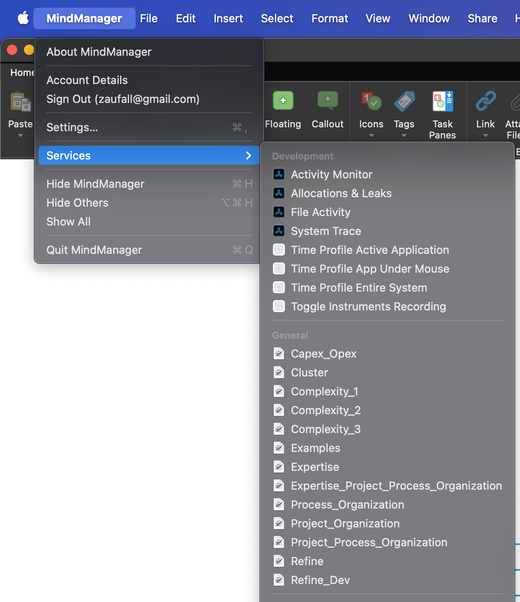

# MindManager AI Integration <br/> Windows + macOS

These automations and macros enhance mindmaps created by **MindManager** on macOS and Windows.

## Windows  

Using MindManager Macro:  

  

## macOS  

Using Automator Workflow (Quick Action):  

  

Using TKInter UI and "Freetext" option (run the `app_tkinter.py` file):  

  

More animated examples are in the `doc` folder.

## Features

### AI platforms and LLMs
  - **Azure OpenAI** w/ `GPT-4.1`, `GPT-4o`, `o4-mini`, `o3-mini`, `o1`, `o1-mini` etc. (use your key or log in with `Azure EntraID`)  
  - **OpenAI** w/ `GPT-4.1`, `GPT-4o`, `o4-mini`, `o3`, `o3-mini`, `o1`, `o1-mini` etc. (use your key)  
  - **Anthropic** w/ `Claude 3.7` etc. models (use your key)  
  - **xAI** w/ `grok-3`, `grok-2-vision` etc.  (use your key)  
  - **Google Gemini** w/ `Gemini Pro 2.5`, `Gemini Flash 2.5`, `Gemma 3` etc. (use your key)  
  - **Google Vertex AI** w/ `Gemini Pro 2.5`, `Gemini 2.5 Flash` etc. (use your access token / OAuth2)
  - **DeepSeek** w/ `DeepSeek V3` (use your key)  
  - **Alibaba Cloud** w/ `Qwen-Max`, `Qwen-Plus`, `Qwen-Turbo` (use your key)  
  - **Mistral AI** w/ `Mistral-Large`, `Pixtral`, `Ministral` (use your key)
  - **AWS Bedrock** w/ `Nova` native models or `Anthropic`, `Mistral` serverless models (use your key + secret)  
  - **Azure AI Foundry** (platform)  w/ `LLaMA`, `Mistral` etc. (use your key)  
  - **GitHub Models** (platform) w/ `GPT-4o`, `LLaMA` etc. (use your key)  
  - **Perplexity** (platform) w/ `LLaMA 3.1-Sonar` etc. (use your key)  
  - **Groq** (platform) w/ `Qwen`, `DeepSeek`, `LLaMA`, `Mixtral` etc. (use your key)  
  - **Hugging Face** (platform)  w/ `LLaMA` and more models (use your token)  
  - **Fireworks AI** (platform)  w/ `LLaMa`, `Qwen` (serverless) etc. (use your key)  
  - **OpenRouter** (platform) w/ many/all models (use your key)
  - **GPT4ALL** (local w/ SDK) w/ any `llama.cpp` model
  - **Ollama** (local w/ API) w/ any `llama.cpp` or `MLX` model
  - **LMStudio** (local w/ API) w/ any `llama.cpp` or `MLX` model
  - **MLX** (local w/ API, Apple Silicon) w/ any `MLX` model

### Image Generation Systems
  - **Azure OpenAI** w/ `DALL-E 3` (use your key or log in with `Azure EntraID`) -> **best tested**
  - **OpenAI** w/ `DALL-E 3` (use your key) -> **best results**
  - **Stability AI** w/ `Stable Diffusion 3` `SD3.5` / `SD3` / `Ultra` / `Core` (use your key)  
  - **Google Vertex AI** w/ `Imagen3` (use your access token / OAuth2, GCP approval required!)  
  - **Ideogram AI** w/ `V1` / `V2` (use your key)  
  - **Black Forrest Labs** w/ `Flux Pro 1.1 Ultra`, `Flux Pro 1.1`, `Flux.1 Pro`, `Flux.1 Dev`  (use your key)  
  - **Recraft AI** w/ `RecraftV3`, `Recraft20B` (use your token)  
  - **Alibaba Cloud** w/ `Qwen Wan 2.2` models
  - **MLX** (local w/ SDK, Apple Silicon) w/ `Flux` models

### Translation Services
 - **DeepL** (use your key)

### Agentic Framework Examples  
  - **Agno** (formerly "Phidata")  
  - **Autogen** (Microsoft)  
  - **CrewAI**  

### Platform
- Windows compatible (run macro/context menu or call the **Python** script directly)  
- macOS compatible (run **Automator** workflow (Quick Action) or call the **Python** script directly)  
- Only native API requests to AI systems - **no middleware needed**

### Layout
- Map format can be radial map or orgchart
- Using map templates on macOS
- Map styles on Windows are persistent, automatic collapsing of nodes

## Implemented Business or Use Cases
1. Refinement of the map or topic.  
2. Refinement of the map or topic from a development perspective.  
3. Create examples for one, more (selected) or all topics.  
4. Clustering topics from scratch.  
5. Clustering by one or more criterias eg. Organization/Process/Project/Expertise, Capex-Opex perspective.  
6. Complex cases (multiple calls): eg. refinement + clustering + examples.  
7. Image generation from topics
8. Professional translation of all topics by DeepL
9. Export `Mermaid` mindmap HTML document
10. Export `Markmap` mindmap HTML document
11. PDF to mindmap (multiple files / batch processing)
12. Generate a working paper (argumentation) HTML document for a detailed mindmap
13. Generate a glossary HTML document of all terms
  
  

## Other Use Cases (implemented or easy to add)
- Export mindmap to any other text format
- Change map layout by using a template (macOS)
- Reorder topics by business value or importance
- Misspelling or syntax correction
- Create a map based on external text data

## User Interface  
There's a new user interface using TKInter to execute most of the operations and more. The app stays always on top and has several UI tabs:  
  
### Action tab  
Choose the desired model and action and click on execute:
  
  
  
### Image tab  
Chose the desired model and the number of images to generate:

  
  
### Freetext tab  
Choose the desired modell, fill in some text how to generate or modify the content and click on execute.  
Examples:  
- "refine"
- "translate all topics to German"
- "add an emoji to every topic" (does only work on MacOS)

  
  
### Translation tab  
Just choose the destination language and click on execute:

  
  
### Agent tab  
Choose an already implemented agent and the desired models.  
The agents list is generated from scripts found in the `ai/agents` folder.  
Before execution the needed libraries have to be installed:  
`pip install -r requirements_agents.txt`.  
CrewAI does not install well on Windows ARM64 by the time of writing.  
Agents do a lot of AI roundtrip calls, so the costs have to be monitored.
  
  
  
### Configuration tab  
By now only the resulting chart format is selectable (orgchart, radial map or automatic selection):  
  
  
  
## Installation  
### Windows  
First install the Windows package manager `Chocolatey` from an administration shell or choose any other way following https://chocolatey.org/install.  
This is one line:  
```
Set-ExecutionPolicy Bypass -Scope Process -Force; [System.Net.ServicePointManager]::SecurityProtocol = [System.Net.ServicePointManager]::SecurityProtocol -bor 3072; iex ((New-Object System.Net.WebClient).DownloadString('https://community.chocolatey.org/install.ps1'))
```  
Change to folder `%localappdata%\Mindjet\MindManager\23\macros`:
```
cd %localappdata%\Mindjet\MindManager\23\macros
```
Copy all files from the GitHub repository to this location.  
Change to `windows` folder:
```
cd windows
```
Run `install.bat` or  the following commands (requirements_auth.txt only if you want to use `Azure Entra ID` or `GCP OAuth2`):
```
cd ..
choco install python3
pip install -U -r .\src\requirements.txt
pip install -r .\src\requirements_auth.txt
powershell -ExecutionPolicy Bypass -File .\windows\macro_registration.ps1
```
Check in registry and MindManager, if the macros are available (right click on topic).  
Hint: The macro list is ordered according to the GUID-string, not the macro name.   

  

Macros can also be executed by the macro editor. The macros are similar but the action parameter.  

  

You can also check here if the path to the python file is correct.  

### macOS  
Python has to be installed first. Go to https://www.python.org/downloads/macos/ and download the desired installer.  
Install required python libraries (requirements_auth.txt only if you want to use `Azure Entra ID` or `GCP OAuth2`, requirements_mac_mlx.txt is only needed for local image generation using MLX):
```
pip install -U -r requirements.txt
pip install -r requirements_mac_mlx.txt
pip install -r requirements_auth.txt
```
Create the directory structure `~/git/mindmanager_ai` with Terminal:
```
cd ~/
mkdir git
cd git
mkdir mindmanager_ai
cd mindmanager_ai
```
Copy all repository files to this location as the Automator workflows contain this path.  
Alternatively you can clone the repository in Terminal:  
```
cd ~/
mkdir git
cd git
git clone https://github.com/robertZaufall/mindmanager_ai.git
cd mindmanager_ai
```
Change to folder `macos` and copy the Automator workflows to the `~/Library/Services` (hidden) folder:
```
cd macos/automator
chmod +x ./copy_to_services.sh
./copy_to_services.sh
```
If you need elevated privileges for copying the files use this command:
```
sudo sh ./copy_to_services.sh
```
All **Automator** workflow settings are similar but the action parameter:  

  

The workflows are then available at the "MindManager" main menu -> Services  

  

### VSCode

I prefer to execute the python script directly from VSCode. Here you can easily adjust the settings, try different LLMs on the fly and even debug, if problems occur (external systems are sometimes not available).  
There are some actions already predefined for quick execution.  

  

## How to use  
### Configuration  
There are main configuration files, each for LLM, image generation and translation.
Open each config file and uncomment the AI model you want to use. In the `config` folder are several environment files for every supported AI model. For example, if you want to use OpenAI models, copy the file `config/openai.env.example` to `config/openai.env` and fill in your api key.  
Use the apropriate LLM system for which you have an API key. These keys are available on the developer platforms of the AI vendors.  
If you want to run local models with `Ollama`, `GPT4All`, `LMStudio`, `MLX` you have to have either a newer Apple Mac model with M1-M4 processor or a desktop or notebook with NVidia graphic card with at least 8GB graphic ram.  

### General
You can have more than one open document in MindManager. The document which should be processed must be the active document. For every processing a new document with the new topics will be created.  

To process the whole map, select the central topic (for right-clicking) or don't select any topic at all and call a macro manually (Windows), choose Automator Workflow from MindManager Menu -> Services or call the python script from VSCode or commandline `python3 process.py <action> <format>`. If it's not working try either `python3` or `python`.  

### Map actions
Select the central topic or deselect all topics and call the automation.  
You can also select one or more topics and start the automation for just these topics, e.g. to generate examples for these topics, refine just these topics etc.  

### Image generation
Just select the topics for which you want to generate an image and choose the action "Generate Image" (macro on Windows or Automator Workflow on macOS) or call the Python script with parameter `image` or `image_n`.  
After a while, the image will be opened and also stored in the MindManager-Library `Images`-folder.  
Unfortunately, on macOS the image cannot automatically be inserted into the map or added to a topic due to insufficient library support.  
On Windows the image can be automatically set as the background image of the map.  

The results from the generation process are best with `FLUX.1`, good with `DALL-E 3` and `SD 3.5`. Prompt crafting/engineering is still in progress.  
The filename is enriched with the generation **seed** where this feature is supoported. This seed is useful if you want to generate similar images (e.g. with different prompt). `DALL-E 3` does not support a seed value anymore (by the time of writing).  
The prompt for image generation can optionally be optimized using a LLM call.
Images can also be generated locally on macOS with Apple Silicon using the native `Apple MLX` framework.  

Recently there are more image generation plattforms trending. `Black Forrest Labs`, `Ideogram AI` and `Recraft AI` image generation from mindmaps is already implemented and the results are amazing.  

### Generation using text summarization (eg. PDF to mindmap)
Put the files into the `input`-folder and use the action `pdf_mindmap`. The PDF files are first converted to markdown (MD) format. 'Reference' sections are removed as these contain no information but take a lot of tokens (e.g. arXiv papers). No OCR takes place by now. Tables are removed and the content will be highly sanitized by removing irrelevant characters, code blocks, href-links, whitespace etc.  
There is no local LLM model using Ollama working for me by now.  

Some models (i.e. `Sonnet`) support native `PDF` processing, which is also implemented (action `pdfsimple_mindmap`).  

### Text generation from mindmaps (working paper (argumentation), glossary)
Generation of larger text outputs needs a model with an higher max-token value like `GPT-4o`, `Gemini Flash`, `Sonnet`. Results are very good, most of the time. 

## LLM systems
### Azure OpenAI / OpenAI
The solution is best tested with `Azure OpenAI`. Results are perfect for every use case. Cheapest ones are `gpt-4.1-mini` and `gpt-4.1-nano`  
Azure EntraID authentication can be used in enterprise scenarios.  
### Google Gemini / Vertex AI
`Gemini Pro 2.5` results are best. `Gemini Flash 2.5` is also very good.  
Vertex AI needs an security token which you can generate using the cloud console.  
### Anthropic Claude 3.5
The Anthropic `Claude 3.7 Sonnet` model ist very good. Anthropic `Claude 3.5 Haiku` is good and also very cheap.
### xAI grok
Grok is very good and is able to refine mindmaps for several levels. The models `grok-3-beta` and `grok-2-vision-1212` are very good. The vision model can be used for pdf ocr.  
### Amazon Bedrock
Amazon Bedrock has some native models i.e. `Nova` (best), and host also 3rd party models of `Anthropic Claude` and `Mistral`.
### DeepSeek
DeepSeek created an extraordinary open source model DeepSeek V3 which seems to be as good as GPT-4o. The reasoning model `r1` does not work by now.  
### Alibaba Cloud
Alibaba Cloud models cannot generate large amounts of tokens (`Qwen-Max`: 2000, `Qwen-Plus` + `Qwen-Turbo`: 1500) but the results are good. `Qwen-Turbo` is very fast. `Qwen 2.5` model is still not available outside China by now (2024-11-22).  
### Mistral AI
Mistral AI is hosting their commercial flagship models `Mixtral-Large` and `Pixtral-Large`. `Mixtral-Large` is a 'best in class' model. The maximum numer of possible output tokens is a little bit unclear (max_tokens may meant to be the sum of input and output tokens).  
### Groq (platform)
Groq is sure the fastest LLM platform by now. `LLaMA3`, `Mixtral` and `Gemma2` are proven models. From time to time the supported models on the platform are changing.  
### Perplexity (platform)
Perplexity works perfect as an universal LLM platform. From time to time the supported models on the platform are changing.  
### Hugging Face (platform)
To access better models a pro-subscription is needed. `LLaMA-3-8B` still can be used.  
### Open Router (platform)  
On the Open Router platform there are a variety of models and systems available. Also fallback scenarios are supported. Furthermore you get access here to the newest OpenAI models like `o1-preview`.  
### GPT4ALL, Ollama, LMStudio (hosted locally - no internet access needed)
Results are dependent on the used model. `LLaMA3`, `Zephyr` and `Mixtral` are working well.  
### MLX (hosted locally on Apple Silicon - no internet access needed)
MLX results are dependent on the used model. `LLaMA3` works well.

## Image generation systems  
### Azure OpenAI / OpenAI - DALL-E 3  
The solution is best tested with `Azure OpenAI`. Results are very good. There is a problem with texts generated within images. Azure EntraID authentication can be used in enterprise scenarios.  
### Stability AI - Stable Diffusion 3 + 3.5  
Image generation with `SD3.5` and `SD3` is the most flexible, as you can use a seed value, negative prompt, etc. Prompt engineering is most important here, as the results are far from being perfect by now.  
### Google Vertex AI - Imagen3  
Image generation results are too simple by now as prompt engineering is also most important here. `Imagen3` has the highest image resolution (1:1 with 1536x1536). `Imagen3` is GA (globally available) but there is an approval process to get access to the API.  
### Ideogram AI  
Image generation is quite good using the `V_2` model. When activating API access, keep in mind that generating an API key immediately results in a $40 bill.  
### Black Forrest Labs  
Image generation is extraordinary. Flagship model is `Flux Pro 1.1 / Ultra`. As usual token have to be prepaid and you need accepted for accessing the platform.  
### Recraft.AI
Image genration is very good. There are many pre-defined styles which can be activated as needed. Available Models are `RecraftV3` and `Recraft20B`.  

### MLX w/ Flux.1, SD3
This local image generation alternative is only available on macOS with Apple Silicon processors like M1 and higher. The results are above average using `Flux.1` model and under average using `SD3` mostly because the prompt is optimized for `Flux.1`.  

There is a new action defined (`image_n` eg. `image=10`) to generate a bunch of images in a row. A pre-executing step can be added to optimize the prompt using a LLM call. If there is only one topic selected there is a different prompt used as when more topics are selected. Only the first level of topics together with the central topic should be selected for better results.  

When using this image generation way, the desired model and embeddings tokenizer will be downloaded automatically. The expected data amount to be downloaded is about 50GB using `Flux.1` and 6GB using `SD3`. If you are using `SD3` for the first time you have to login at **huggingface** with your token first as you have to agree to the terms of **Stability AI** and the usage of their model: `huggingface-cli login --token <xyz>`. Downloaded models are cached at `~/.cache/huggingface`.

## Translation systems
### DeepL
Translation works for these languages:
```
# supported languages as source
# BG,CS,DA,DE,EL,EN,ES,ET,FI,FR,HU,ID,IT,JA,KO,LT,LV,NB,NL,PL,PT,RO,RU,SK,SL,SV,TR,UK,ZH

# supported languages as target
# BG,CS,DA,DE,EL,EN-GB,EN-US,ES,ET,FI,FR,HU,ID,IT,JA,KO,LT,LV,NB,NL,PL,PT-BR,PT-PT,RO,RU,SK,SL,SV,TR,UK,ZH
```
Source language will be detected automatically. `Formality` parameter is not supported for all languages, so it is disabled by now. `Context` parameter was not used as DeepL states it's deprecated.
API requests point to the free tier. If you have a paid subscription change the URL in the `config.py`.

## Agentic frameworks  
There are only some example implementations using agentic frameworks. Results are requested as markdown code from the agents and are transformed to Mermaid mindmap by another LLM call. This should be addressed soon.  

### Agno (formerly Phidata)  
https://github.com/agno-agi/agno  
Mighty but very performant and easy to use framework.  

### Autogen (Microsoft)  
https://github.com/microsoft/autogen  
Framework is complex and not so easy to use. There is also a fork with a similar name `pyautogen`, renamed as AG2.  

### CrewAI  
https://github.com/crewAIInc/crewAI  
Mighty and complex framework. Installation on Windows 11 on ARM requires VS2022 build tools. Installation on MacOS seems to be more easy but still has a lot of dependencies.  

## Prompt crafting  
Prompt crafting is lightly implemented using the following strategy:  

  

## Platform specific implementations
The `mindm` component is used on both platforms for MindManager automation.  
[Link to GitHub Repository](https://github.com/robertzaufall/mindm/)  
[Link to GitHub Pages](https://robertzaufall.github.io/mindm/)  

### Windows  
MindManager COM objects are addressed by using the PyWin32 library:  


### macOS  
MindManager objects are addressed by using the AppScript library:  


## Implementation details  
The Mermaid mindmap syntax is used when talking to the OpenAI LLM as an intermediate "language". Log file contents for input, output, prompt can be used in other use cases eg. mindmap visualizations in GitHub markdown files.  

  

Log files content:  


Example using a Mermaid mindmap in a GitHub markdown file.  
Code:
```


Github rendering of the map:


You can also use the content inside the Mermaid online editor (https://mermaid.live/edit):  

  

## Disclaimer
The API execution time depends heavily on the used LLM model or system and token count.  

Currently, this project is in the early development phase, and generated outputs may include errors. Automated testing has not yet been implemented.  


